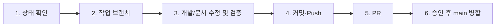

# storygame 로컬 ↔ GitHub 상태 확인 및 동기화 가이드

> **목적**: 세션마다 대형 상태 문서를 반복해서 읽지 않고, GitHub `main`과 현재 작업 PR의
> 실제 상태를 빠르게 확인하기 위한 요약 문서입니다. 동적인 로컬/원격 차이는 항상
> `npm run status:check`의 현재 출력값을 우선합니다.

---

## 1. 현재 최신 기준선 스냅샷 — 2026-09-09

| 항목 | 현재 사실 | 비고 |
|---|---|---|
| **공유 기준 브랜치** | `main` | GitHub `LUCKYBRIDGE/story-maker` |
| **현재 main HEAD** | `d545456` | 행정적 되돌림 커밋. Git tree는 제품 기준 `67be51a`와 동일 |
| **최신 제품 커밋** | `67be51a` | `메모 창 조절과 원본 예시 작품, 가까운 컷 이동 개선 (#12)` |
| **PR #12** | 병합 완료 | 메모 조절·원작 전체 예시·근접 컷 이동 |
| **최신 main CI** | 성공 | Actions run `34346214614`; 되돌림 후 동일 제품 tree에서 전체 CI 성공 |
| **최신 GitHub Pages** | 성공 | Actions run `34346214609`; 동일 제품 tree 재배포 성공 |
| **공개 주소** | `https://luckybridge.github.io/story-maker/` | 현재 배포 tree는 `67be51a` 제품 tree와 동일 |
| **브라우저 최신 QA** | 통과 | Chrome 1365×900 / 820×1180 / 390×844 |
| **실기기 QA** | 미완료 | iOS/Android 한글 IME·소프트 키보드·Safe Area·실터치 |
| **의존성 감사** | 조치 PR 준비 | 최신 registry 감사 8건(1 moderate, 7 high) → PR #14 최소 패치 후보에서 2 high로 감소; 남은 2건은 `vinext → image-size` upstream |

### 현재 구현된 주요 기능

- U1 스튜디오 UI 개편(U1-00~U1-11)과 U2 이어쓰기 흐름
- 장·컷 편집, 컷 추가/복제/이동/삭제/분할·합치기와 작업 위치 복원
- 편집본(draft)과 플레이 버전(active) 분리, 자동 기기 저장·체크포인트·삭제 되돌리기
- Excel 8탭 저장/불러오기 및 이전 양식 호환, 공개 Google 시트 읽기
- 컷 장면 연출 5종, 책 앞/뒤표지·작가의 말·커튼 재생
- 2/3개 선택지, 갈래·합류·별도 결말, 기존 뒷이야기 연결 및 경로별 이전/재선택
- 모바일·태블릿·웹 반응형 첫 화면과 공통 UI
- 글쓰기 옆 창작 메모, 작품/장 범위·검색·복원, 이동·크기 조절
- 토끼와 자라·옹고집전 원작 전체 예시의 독립 재생

### 현재 남아 있는 명시적 검증/승인 항목

- 실제 iOS Safari / Android Chrome에서 한글 IME·가상 키보드·Safe Area·실터치 확인
- 실제 공유 Google 시트 계정/권한을 이용한 종단 검증
- 원작의 전체 경로 서사·연출 품질 검수 (다섯 도달 결말의 대표 자동 재생은 PR #17 통과)
- A1-02 캐릭터 감정 세트의 사람 시각 승인 및 무대 검수
- PR #14 보안 패치 main 반영 여부 결정
- `vinext 0.0.50 → image-size 2.0.2`의 upstream stable 보안 수정 추적

A1-02는 사람 승인 전 `BLOCKED`입니다. 승인·외부 조건이 해결되기 전에는 자동으로
`READY` 작업을 열지 않습니다.

---

## 2. ⚡ 1초 초고속 현황 확인

로컬 또는 Work 실행 환경에서는 아래 명령을 먼저 사용합니다.

```bash
npm run status:check
```

이 명령은 현재 로컬 브랜치·HEAD, `origin/main`, 작업 트리, 열린 GitHub PR을 동적으로
확인합니다. 테스트를 다시 실행하지 않으므로 검증 이력은 이 문서와
`docs/storygame-development-status.md`를 함께 봅니다.

출력 형식 예시:

```text
==============================================================
 📖 storygame 로컬 ↔ GitHub 최신 동기화 현황 (Fast Check)
==============================================================
• 로컬 브랜치   : <현재 브랜치>
• 로컬 HEAD     : <현재 HEAD>
• 원격 main HEAD: <origin/main HEAD>
• 동기화 상태   : <In-Sync 또는 Ahead/Behind>
• 작업 트리     : <Clean 또는 변경 파일>
• 열린 GitHub PR: <현재 열린 PR>
• 최근 검증 기록: STATUS.md 참조 (이 명령은 테스트를 실행하지 않음)
==============================================================
```

> 단일 Git 명령으로 확인할 때:
>
> ```bash
> git fetch origin --quiet && git status -sb && git log -1 --oneline
> ```

---

## 3. 최신 검증 증거

### 제품 기준 PR #12 / `67be51a`

- `npm run check`: 통과
- `npm test`: **169/169 통과**
- `npm run build:pages`: PR 검증에서 통과
- 병합 후 GitHub Actions CI run `34331728797`: 성공
- GitHub Pages run `34331728819`: 성공
- Chrome 1365×900 / 820×1180 / 390×844:
  - 창작 메모 기본 닫힘
  - 메모 드래그·방향키 이동·크기 조절·초기화·작성/복원
  - 컷 미리보기/글상자 이전·다음 이동과 스크롤 유지
- 원작 예시:
  - 원본 133/450개 컷 문장 전체 대조
  - 분기 안내·단일 행동 포함 재생본 136/453개 컷
  - 연결/정규화 검사 통과
  - 두 작품의 첫 선택 경로에서 분기→결말 브라우저 재생
  - 예시 전후 사용자 저장본 불변 확인

### 현재 main 복구 상태 / `d545456`

- `d545456`의 Git tree는 `67be51a`와 동일하다.
- main CI run `34346214614`: 성공.
- GitHub Pages run `34346214609`: 성공.
- 따라서 현재 공개 제품 파일은 PR #12 완료 제품 tree와 동일하다.

### 의존성 보안 진단 / PR #14

- 현재 registry 기준 원본 의존성 감사: **8건** — moderate 1, high 7.
- 실제 원인 패키지: `sharp 0.35.3`, `fflate 0.7.4`, `image-size 2.0.2`와 상위 전파 경로.
- 최소 패치 후보:
  - `sharp 0.35.4`
  - `fflate 0.7.5`
- 후보 감사 결과: **2 high**만 남음. 둘 다 `vinext 0.0.50 → image-size 2.0.2` 경로다.
- PR #14 최종 CI run `34347041043`: `npm ci`, whitespace, `npm run check`, `npm test` 모두 성공.
- `image-size`의 현재 audit 자동 해결안은 Vinext 1.0 beta 계열의 semver-major 변경이므로 강제 적용하지 않았다.

**EX-01 당시 미증명** (후속 PR #17에서 다섯 결말 대표 자동 재생 통과): 모든 원작 결말의 시각 재생, 실제 iOS/Android IME·터치,
실제 공유 Google 계정 기반 시트 종단 동작.

---

## 4. 주요 완료 이력 요약

| 작업 | 상태 | 최신 의미 |
|---|---|---|
| U1-00 ~ U1-11 | `DONE` | 메인→구성→대본/컷→적용→플레이→현재 컷 수정의 핵심 흐름과 반응형 통합 검증 |
| U2-01 ~ U2-02 | `DONE` | 두 전래동화 위기 지점 이어쓰기와 글쓰기 중심 공통 프레임 |
| CE-01 | `DONE` | 컷 연출 5종·강도·시점·지연, 저장/Excel/플레이 |
| BC-01 | `DONE` | 학생 커스텀 표지·뒤표지·작가의 말·커튼 재생 |
| BR-01 | `DONE` | 2/3 선택·분기·합류·다른 결말·기존 뒷이야기 배치 |
| HS-01/02 | `DONE` | 첫 화면 공통 UI, 글자 선명도, 폭/방향별 반응형 |
| MN-01 | `DONE` | 가벼운 포스트잇 메모와 Excel/시트 오류 보호 |
| EX-01 | `DONE` | 메모 조절·원작 전체 예시·근접 컷 이동; PR #12로 main/Pages 반영 |
| SEC-01 | `READY FOR MERGE` | PR #14: sharp/fflate 최소 보안 패치, audit 8→2, 전체 CI 성공 |
| A1-02 | `BLOCKED` | 캐릭터 감정 세트의 사람 승인 필요 |

과거 각 작업 시점의 테스트 수(109/109, 147/147, 159/159, 166/166 등)는 당시 완료
증거로 유효하지만 **현재 제품 회귀 기준은 169/169**입니다.

---

## 5. AI 세션 시작 시 권장 확인 순서

1. GitHub 연결 Chat에서는 `main` HEAD와 열린 PR을 GitHub에서 확인합니다.
2. Work/로컬에서는 `npm run status:check`를 실행합니다.
3. 제품 기능 사실은 실제 소스를 우선합니다.
4. 현재 작업·완료 증거는 `docs/storygame-development-status.md`를 봅니다.
5. 문서와 코드가 다르면 구현된 사실은 코드로 확인하고 같은 작업에서 문서를 맞춥니다.

권장 요청 예시:

```text
먼저 STATUS.md와 GitHub main/열린 PR을 확인하고,
필요할 때만 상세 개발 상태표의 관련 섹션을 읽어서 다음 작업을 진행해줘.
```

---

## 6. 표준 GitHub 반영 흐름



1. 시작 전 확인
   ```bash
   npm run status:check
   git checkout main && git pull origin main
   ```
2. 작업 브랜치 생성
   ```bash
   git checkout -b <기능명>
   ```
3. 코드 작업이면 필요한 좁은 검사 후
   ```bash
   npm run check
   npm test
   ```
   문서 전용 변경이면 링크·사실·diff를 우선 검사하고, 코드 계약을 건드렸을 때만 해당 검사를 추가합니다.
4. 커밋·Push
5. PR 생성
6. CI와 필요한 브라우저/실기기 증거 확인 후 사용자 승인 범위에서 main 병합

---

## 7. 자주 발생하는 불일치 상황

| 상황 | 원인 | 처리 |
|---|---|---|
| 로컬이 원격보다 뒤처짐 | GitHub에서 머지됐으나 로컬 미반영 | `git checkout main && git pull origin main` |
| 로컬이 원격보다 앞섬 | 로컬 커밋 후 원격 미반영 | 작업 브랜치를 push하고 PR로 공유 |
| 미커밋 변경 존재 | 작업 중 사용자/도구 변경 | 먼저 보존·범위 확인. 임의 삭제 금지 |
| CI whitespace 오류 | 줄 끝 공백 등 | `git diff --check <base> HEAD` |
| 문서 테스트 수가 다름 | 과거 작업 시점 기록과 현재 기준선 혼동 | 완료 이력은 보존하고 상단 현재 기준선만 최신 값으로 갱신 |
| PR 상태와 main 코드가 다름 | stacked/squash PR 또는 후속 PR이 선행 변경까지 포함 | main tree를 실제 비교하고 중복 PR을 superseded로 정리 |

---

## 8. 과거 스냅샷 해석 원칙

이 문서는 **현재 기준선**을 빠르게 보여 주는 용도입니다. 세부 작업의 당시 브랜치,
테스트 수, 로컬 브라우저 수치와 같은 역사적 증거는
`docs/storygame-development-status.md`에 보존합니다.

예를 들어 BC-01의 147/147, CE-01의 140/140, BR-01/HS-02의 159/159,
MN-01의 166/166은 각 작업 당시 검증 기록이며 현재 최신 테스트 수와 충돌하는 값이
아닙니다. 현재 상태를 판단할 때는 이 문서 상단의 기준선과 실제 GitHub `main`을
우선합니다.


## 안정화 QA 후속 검증 — 2026-09-09

[안정화 재검토·실행 보고서](docs/qa/stabilization-2026-09-09.md)에 현재 PR의 자동 검증,
원본 도달 불가 경로, 보안 재감사와 사람 검증 경계를 기록했다. PR #16/#17/#18의
CI 성공은 main에 QA가 이미 통합됐다는 뜻이 아니다. main merge·보호 설정은 승인 대기다.
