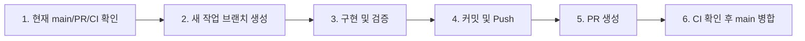

# story-maker GitHub 기준선 및 동기화 가이드

> 목적: 긴 개발 이력 문서를 매번 처음부터 읽지 않고도 현재 GitHub 기준선, 열린 PR, 검증 상태, 다음 확인 위치를 빠르게 파악하기 위한 문서이다.

---

## 1. 현재 제품 기준선 — 2026-09-12

`codex/library-craft`의 커밋 `a0809e0 feat: refine library and reading experience`가 **PR #23**으로 `main`에 병합되었다. 병합 직후 제품 기준 merge commit은 `a18b7ca39a640e92b9d56c5f13f0f6fe9e0fd216`이다.

PR #23에서 현재 `main`에 들어온 핵심 변경은 다음과 같다.

- **HOME-01**: 상단 `이야기 변경` / `나만의 이야기` / `서재 입장`, 하단 `이야기 읽기`
- **LIB-02~LIB-11**: 반응형 목재 서재, 책 안착·전경·조명 조정, 빈 윤곽 책을 통한 새 이야기 시작
- **PLAY-UI-01**: 하단 글상자 기본 35%·20~60% 조절, 인물 그룹별 표시 크기, 같은 탭에서 읽기 화면·컷·선택 경로·표지 상태 복원
- 기존 **U1~U2 / BR-01 / CE-01 / BC-01 / SP-A~SP-F** 기능 유지

`docs/storygame-development-status.md`의 9월 11~12일 개별 항목에는 작업 당시의 “로컬 적용”, “미커밋”, “미푸시” 문구가 역사 기록으로 남아 있다. 해당 표현은 **당시 시점 기록**이며, 위 LIB/HOME/PLAY-UI 작업은 PR #23을 통해 이미 GitHub `main`에 반영되었다. 현재 반영 여부를 판단할 때는 이 문서와 실제 GitHub `main`을 우선한다.

---

## 2. 현재 GitHub 상태

| 항목 | 현재 기준 |
|---|---|
| 기본 브랜치 | `main` |
| 최신 제품 기능 병합 | PR #23 `feat: refine library and reading experience` |
| PR #23 원본 커밋 | `a0809e0` |
| PR #23 병합 직후 commit | `a18b7ca` |
| 기준선 동기화 | PR #24 `chore: sync docs and smoke test with current main` |
| 열린 별도 PR | **#14 의존성 보안 정리** |
| GitHub Pages | PR #23 병합 후 deploy run #21 성공 |
| 단위·회귀 수 | PR #23 작업 기준 **198개 통과** |
| 최신 전체 검증 | PR #24 CI run #100 **성공** |
| 브라우저 smoke | `start-screen`, `story-flow`, `sticky-memos`, `pinky-examples` 성공 |
| 교실 QA | 모바일 터치·Google 시트 fixture 성공 |

### PR #23 직후 CI 실패와 정리 결과

PR #23 병합 후 `main`의 CI run #96은 `Static checks`, `Build and tests`, `Build GitHub Pages artifact`까지 성공한 뒤 **Browser smoke regression** 단계에서 실패했다.

원인은 제품 코드가 아니라 테스트 코드가 과거 첫 화면의 `.entry-template-options[open]` 요소를 계속 기다리고 있던 데 있었다. 현재 UI는 메인 화면의 `나만의 이야기`와 서재/읽기 흐름으로 재구성되었고, 같은 탭의 편집·읽기 상태도 복원한다.

PR #24에서 다음 QA를 현재 계약에 맞게 동기화했다.

- `tests/browser/story-flow.mjs`
- `tests/browser/sticky-memos.mjs`
- `tests/browser/pinky-examples.mjs`
- `tests/browser/support/classroom-fixture.mjs`

그 결과 **CI run #100에서 whitespace, Static checks, Build and tests, Chromium, GitHub Pages artifact, Browser smoke regression, Classroom touch and sheet fixtures가 모두 성공**했다.

---

## 3. 현재 대표 사용자 흐름

```text
메인
  ├─ 이야기 읽기
  │    → 현재 선택 기본 작품의 앞표지
  │    → 이야기 펼치기
  │    → 읽기 / 선택 경로 / 뒤표지
  │
  ├─ 이야기 변경
  │    → 서재
  │
  ├─ 서재 입장
  │    → 서재
  │    → 책 선택
  │    → 읽기 / 편집 / 공유 작품 흐름
  │
  └─ 나만의 이야기
       → 창작 허브
       → 새 작품 / 이어만들기 / 파일 가져오기

편집
  ↔ 대본 전체 / 컷 꾸미기
  → 플레이에 적용
  → 책 표지 / 플레이
```

서재의 빈 윤곽 책은 별도 고정 버튼이 아니라 실제 책 순서에 포함되며, 선택하면 기존 생성 흐름을 연다.

---

## 4. 저장·공유 기준

- 기기 로컬 저장소에 최대 2개 창작 프로젝트를 격리 보관한다.
- `.nolstory` 파일로 백업·기기 이동·공유 읽기를 지원한다.
- 공유 작품의 고쳐쓰기는 복제 허용 정책과 프로젝트 슬롯 제한을 따른다.
- 원본과 고쳐쓴 작품은 별도 프로젝트이며 출처를 보존한다.
- Excel 저장·불러오기와 공개 Google 시트의 일회성 읽기를 유지한다.
- 중앙 학생 작품 서버, 로그인, 실시간 공동 편집, Google OAuth는 현재 제품 범위가 아니다.
- 같은 탭 화면·읽기 상태 복원은 `sessionStorage`, 표시 설정은 `localStorage` 기반이며 저장이 차단된 환경의 영구 복원은 보장하지 않는다.

---

## 5. 열린 유지보수 PR

### PR #14 — 의존성 보안 정리

PR #14는 `sharp`와 `fflate`의 안전한 패치 업데이트를 담고 있으며, 제품 UI 변경과는 분리된 유지보수 작업이다.

현재 이 브랜치는 최신 `main`과 분기되어 있으며 **main보다 25커밋 뒤처진 상태**이다. 변경 파일은 `package.json`, `package-lock.json` 두 개뿐이지만, PR 본문에 “별도 승인 전 main 병합 금지”가 명시되어 있으므로 자동 병합하지 않는다. 병합을 결정할 때는 최신 `main` 위에서 dependency diff를 다시 재현하고 CI를 새로 확인한다.

---

## 6. 빠른 현황 확인

로컬 작업 환경에서는 다음 명령을 먼저 실행한다.

```bash
npm run status:check
```

또는 최소 확인은 다음과 같이 한다.

```bash
git fetch origin --quiet
git status -sb
git log -1 --oneline
gh pr list --state open
```

`STATUS.md`에는 의도적으로 “항상 최신인 HEAD SHA”를 고정하지 않는다. 문서를 수정해 병합하는 순간 HEAD가 다시 바뀌기 때문이다. 실제 최신 commit은 위 명령 또는 GitHub `main`에서 확인하고, 이 문서는 **기능 기준선과 검증 상태**를 기록한다.

---

## 7. 표준 작업 흐름



1. **시작 전 확인**
   ```bash
   npm run status:check
   git checkout main && git pull origin main
   ```
2. **작업 브랜치 생성**
   ```bash
   git checkout -b <기능명-날짜>
   ```
3. **검증**
   ```bash
   npm run check
   npm test
   npm run qa:smoke
   git diff --check
   ```
4. **커밋·푸시·PR**
   ```bash
   git add -u
   git commit -m "<type>: 작업 내용"
   git push origin <현재브랜치>
   gh pr create
   ```
5. **CI 성공 확인 후 병합**
   ```bash
   gh pr checks
   gh pr merge --merge
   ```

---

## 8. 문서 우선순위

현재 상태를 판단할 때는 다음 순서를 사용한다.

1. 실제 GitHub `main`, 열린 PR, Actions
2. `STATUS.md` — 빠른 현재 기준선
3. `README.md` — 사용자·개발자용 현재 기능 개요
4. `docs/storygame-development-status.md` — 상세 작업 이력과 검증 증거
5. `docs/storygame-detailed-design.md` — 제품·화면·데이터 설계 계약
6. `docs/tasks/storygame-atomic-task-cards.md` — 작업 단위 계약과 과거 순서 기록

`storygame-development-status.md`와 원자 작업 카드의 오래된 `READY`, “다음 작업”, “미커밋” 문구는 해당 작업 당시의 기록일 수 있다. 최신 실행 결정을 내릴 때는 문서 맨 위의 최신 항목과 실제 GitHub 상태를 교차 확인한다.

---

## 9. 자주 발생하는 불일치

| 상황 | 판단 기준 | 처리 |
|---|---|---|
| 문서에는 미푸시인데 코드가 main에 있음 | GitHub commit/PR | 문구를 역사 기록으로 보고 STATUS에 동기화 사실 기록 |
| README 테스트 수가 다름 | 최신 `npm test`/CI | 최신 검증 수로 갱신 |
| 브라우저 smoke만 실패 | 실패 suite 로그 | 제품 회귀인지 구형 selector인지 분리 진단 |
| 로컬 main이 GitHub보다 뒤처짐 | `git status -sb` | `git pull origin main` |
| 열린 오래된 PR 존재 | GitHub PR 목록 | 현재 main과 비교 후 유지·업데이트·종료 판단 |
| 문서 HEAD가 실제 HEAD와 다름 | 실제 `main` | SHA를 영구 기준으로 쓰지 말고 기능 기준선 중심으로 기록 |
