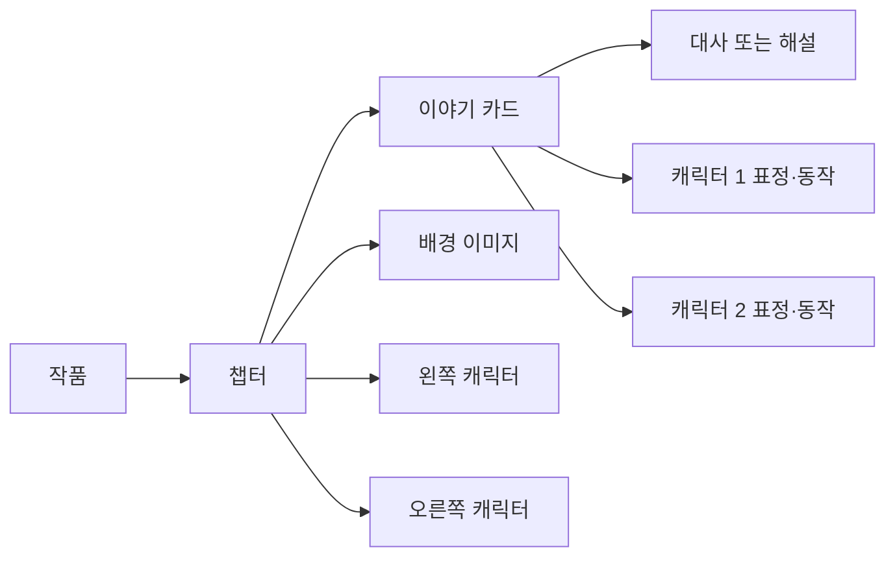
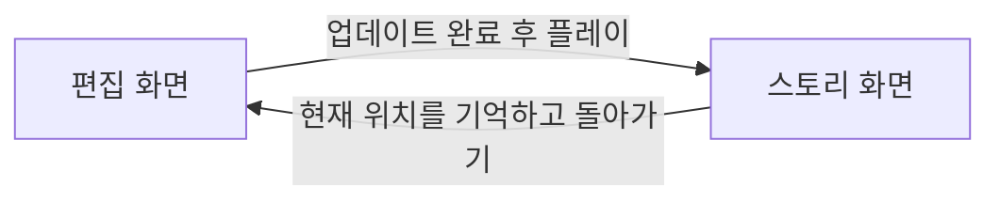
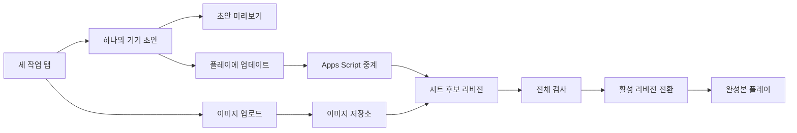

# 학생용 스토리게임 웹 상세 설계 — 보관본

- 문서 상태: v3 로컬 우선 설계로 대체된 보관본
- 버전: 2.0
- 기준일: 2026-07-23
- 구현 상태: 기능 코드 작성 전
- 대상: 초등 고학년을 사용성 기준으로 한 혼합 연령 학생

## 1. 문서의 목적

이 문서는 학생이 웹 또는 태블릿에서 캐릭터, 대사, 해설, 배경을 조합해
클릭형 스토리게임을 만드는 서비스의 기준 설계다.

기존 Unity WebGL 작품의 `스테이지`, `NPC`, `대사`, 좌표, 이벤트 구조를
그대로 재현하지 않는다. 학생에게 필요한 창작 단위를 `챕터`, `캐릭터`,
`대사·해설`, `이미지`로 줄인다.

이 문서가 합의되기 전에는 시각 디자인, 이미지 생성, 기능 구현, 배포를
진행하지 않는다.

## 2. 제품 한 문장 정의

학생이 한 기기에서 챕터별 등장인물과 대사·해설을 만들고, 외부에서 준비한
캐릭터·배경 이미지를 넣어 즉시 플레이할 수 있는 구글 시트 기반
스토리게임 제작 웹이다.

## 3. 대상 사용자와 사용 환경

### 3.1 대상

- 사용성 기준: 초등학교 4~6학년
- 확장 대상: 중학생, 고등학생, 교사
- 기본 작업 방식: 학생 한 명이 기기 한 대에서 작품 하나를 제작
- 모둠 활동: 한 기기를 함께 보며 역할을 나누거나 차례로 편집
- 같은 기기 모둠 활동에는 별도 로그인·역할·동시 편집 기능을 추가하지 않음
- 여러 기기 실시간 공동 편집: 후속 단계

### 3.2 기기

- 학교 태블릿
- 크롬북 또는 노트북
- 데스크톱 웹 브라우저
- 휴대전화는 플레이를 우선하되 핵심 편집 기능도 한 화면씩 지원

### 3.3 대표 화면

- 데스크톱: 1440×900
- 태블릿 가로: 1024×768 이상
- 태블릿 세로: 768×1024 이상
- 모바일 세로: 390×844
- 모바일 가로: 844×390

편집은 태블릿 가로 환경에서 가장 편하게 만들되 화면 회전을 강제하지 않는다.
플레이는 위 다섯 화면에서 같은 작품 데이터와 같은 원본 이미지를 사용한다.

## 4. 제품 목표

### 4.1 반드시 달성할 목표

- 초등 고학년이 짧은 설명만 듣고 첫 챕터를 만들 수 있다.
- 코드, 행 번호, 좌표, 이미지 URL을 학생이 직접 입력하지 않는다.
- 대사와 해설을 카드처럼 추가하고 순서대로 재생할 수 있다.
- 캐릭터를 글상자 기준 왼쪽과 오른쪽에 자유롭게 배치할 수 있다.
- 대사마다 표정·동작 이미지를 바꿀 수 있다.
- 학생이 외부에서 준비한 투명 캐릭터와 배경 이미지를 추가할 수 있다.
- 편집 중 언제든 현재 위치부터 플레이할 수 있다.
- 구글 시트에서 수정한 내용도 웹에 다시 불러올 수 있다.

### 4.2 첫 버전에서 달성하지 않을 목표

- 툴 내부 AI 이미지 생성
- 툴 내부 자동 배경 제거와 손 지우개
- 여러 기기의 실시간 공동 편집
- 전투, 인벤토리, 맵 탐색, 캐릭터 이동 좌표
- 복잡한 애니메이션
- 조건, 변수, 점수, 반복
- 교사 학급 관리 대시보드
- 공개 작품 커뮤니티

## 5. 핵심 설계 원칙

### 5.1 쉬운 시작, 깊은 확장

모든 학생은 같은 편집기를 사용한다. 기본 기능을 먼저 보여주고 고급 연출은
접힌 선택 사항으로 제공한다. 학년 이름으로 기능을 구분하지 않는다.

### 5.2 역할과 위치를 분리

주인공이 항상 왼쪽이라는 규칙을 두지 않는다. 각 챕터에는 `왼쪽 자리`와
`오른쪽 자리`가 있으며, 어느 캐릭터든 원하는 자리에 놓을 수 있다.

### 5.3 카드 순서가 이야기 순서

챕터 카드와 이야기 카드의 위에서 아래 순서가 플레이 순서다. 학생이 별도의
흐름도나 노드 연결 규칙을 배우지 않아도 된다.

### 5.4 선형 전개 우선

첫 버전은 시작부터 결말까지 순서대로 진행한다. 선택지와 여러 결말은 기본
편집 경험을 검증한 뒤 추가한다.

### 5.5 이미지 제작은 외부, 배치와 확인은 웹

학생은 외부 AI 도구나 그림 도구에서 이미지를 준비한다. 서비스는 이미지
생성이나 배경 제거를 대신하지 않는다. 업로드한 이미지를 실제 장면 위에서
확인하고 사용할지는 학생이 결정한다.

### 5.6 이야기 구상은 활동지, 실제 적용은 웹

아이디어 발상, 주제 정하기, 처음·가운데·끝의 뼈대, 모둠 역할 나누기까지
모두 앱 안에 넣지 않는다. 이 과정은 인쇄 활동지 또는 교사가 복사해 쓰는
디지털 활동지로 지원한다.

웹 편집기는 실제 플레이에 들어가는 다음 내용만 다룬다.

- 작품 제목
- 챕터 제목과 한 줄 줄거리
- 챕터별 배경과 왼쪽·오른쪽 캐릭터
- 대사와 해설
- 표정·동작 이미지와 간단한 연출

권장 수업 흐름:

1. 활동지에서 이야기 아이디어와 처음·가운데·끝 정리
2. 사용할 캐릭터와 장소 결정
3. 웹에서 챕터·캐릭터·배경 입력
4. 대사와 해설 입력
5. 현재 카드 또는 원하는 챕터부터 초안 미리보기
6. `플레이에 업데이트`로 완성본 반영
7. 처음부터 또는 원하는 챕터부터 플레이하며 수정

활동지는 앱의 필수 입력 데이터가 아니다. 활동지를 사용하지 않는 학생도
바로 웹 편집을 시작할 수 있다.

## 6. 콘텐츠 모델



### 6.1 작품

- 작품 제목
- 작품 설명
- 작성자 별명
- 시작 챕터
- 작품 화풍
- 마지막 저장 시각

### 6.2 챕터

- 챕터 제목
- 순서
- 배경
- 캐릭터 1과 화면 위치
- 캐릭터 2와 화면 위치
- 이야기 카드 목록

### 6.3 이야기 카드

- 종류: 대사 또는 해설
- 말하는 캐릭터 ID 또는 해설
- 내용
- 캐릭터 1의 표정·동작 이미지
- 캐릭터 2의 표정·동작 이미지
- 추가 연출

학생 화면에서는 `왼쪽의 토끼`, `오른쪽의 자라`처럼 보여준다. 내부 데이터는
왼쪽·오른쪽이 아니라 캐릭터 ID로 저장한다. 이후 자리 배치를 바꾸더라도
대사의 화자와 표정 이미지가 다른 캐릭터로 바뀌지 않아야 한다.

### 6.4 추가 연출

기본 화면에서는 접어 둔다.

- 이 카드에서만 자리 바꾸기
- 왼쪽 캐릭터 숨기기
- 오른쪽 캐릭터 숨기기
- 두 캐릭터 모두 숨기기
- 배경 어둡게 하기

## 7. 상위 화면과 편집 구조

### 7.1 편집 화면과 스토리 화면

서비스는 두 개의 상위 화면으로 명확히 구분한다.

| 화면 | 목적 | 허용 작업 |
|---|---|---|
| 편집 화면 | 작품을 만들고 수정 | 캐릭터, 챕터·장소, 대사·해설 편집과 업데이트 |
| 스토리 화면 | 완성된 버전을 읽고 플레이 | 이전·다음 진행, 챕터 이동, 편집 화면으로 돌아가기 |

스토리 화면 안에서 내용을 직접 수정하지 않는다. `편집으로 돌아가기`를 누르면
현재 챕터와 대사 위치를 기억한 채 편집 화면으로 이동한다.



### 7.2 편집 화면의 세 작업 탭

편집 화면에는 다음 세 작업 탭만 항상 같은 순서로 표시한다.

1. 캐릭터 이미지
2. 챕터·장소
3. 대사·해설

`이야기 뼈대`는 챕터·장소 탭의 챕터 목록에서 다룬다. `플레이 점검`은 별도의
스토리 화면에서 수행한다. 세 작업 탭은 하나의 기기 초안을 공유하며 변경
내용이 있어도 자유롭게 오갈 수 있다.

### 7.3 작업 탭 이동 규칙

- 현재 작업 탭은 색상, 굵기, 아이콘을 함께 사용해 표시한다.
- 각 탭에는 `작업 중`, `업데이트 필요`, `업데이트 중`, `완료`,
  `수정 필요` 상태를 표시한다.
- 입력 내용은 먼저 기기 초안에 저장되고 관련된 모든 편집 탭과 미리보기에
  즉시 반영된다.
- 탭 이동은 원격 업데이트를 시작하지 않으며 입력 내용도 잃지 않는다.
- 각 탭에는 같은 `플레이에 업데이트` 버튼을 제공한다.
- 어느 탭에서 누르더라도 현재 기기 초안 전체를 하나의 플레이 버전으로
  업데이트한다.
- 업데이트 시작 후 성공 또는 강제 중지 확인 전까지 모든 조작을 잠근다.
- 돌아왔을 때 선택한 챕터, 카드, 이미지, 스크롤 위치를 복원한다.
- 탭의 `수정 필요` 표시를 누르면 해당 문제 목록을 연다.
- 여러 탭에 걸친 수정 필요가 발견되면 업데이트를 시작하지 않고 해당 탭으로
  자유롭게 이동해 한 초안 안에서 함께 고친다.

처음부터 구글 시트 주소나 내부 코드를 요구하지 않는다. 작품과 시트의 연결은
교사·운영자 설정 또는 미리 준비한 실행 링크에서 처리한다.

### 7.4 캐릭터 이미지 편집

화면을 `기본 제공`과 `내가 추가한 이미지`로 나눈다.

1. 이야기에서 사용할 캐릭터 선택
2. 기본 이미지 확인
3. 필요한 표정·동작 확인
4. 부족하면 외부에서 만든 이미지를 업로드
5. 캐릭터 이름과 이미지 이름 정리
6. 실제 배경 위 투명 상태 확인
7. 필요할 때만 `작게·기본·크게`와 `좌우 뒤집기` 확인

이 탭에서는 왼쪽·오른쪽 자리를 정하지 않는다. 캐릭터의 역할과 화면 위치를
분리하기 위해 자리 배치는 챕터·장소 탭에서 정한다.

캐릭터 크기는 기본적으로 서비스가 투명하지 않은 실제 그림 영역을 찾아
자동으로 맞춘다. 학생에게 픽셀 크기, 확대 비율, 가로 좌표를 입력하게 하지
않는다. 자동 결과가 어색할 때만 `작게 90%`, `기본 100%`, `크게 110%`의
세 단계로 보정한다. 이 값은 기기별 값이 아니라 해당 이미지에 한 번만
저장된다.

### 7.5 챕터·장소 편집

챕터의 구조와 실제 무대를 함께 설정한다.

1. 작품 제목과 챕터 목록 확인
2. 챕터 추가, 복제, 순서 변경, 보관
3. 챕터 제목과 한 줄 줄거리 입력
4. 배경 선택
5. 왼쪽 자리와 오른쪽 자리의 캐릭터 선택
6. 필요하면 `자리 바꾸기`

캐릭터를 한 명만 사용할 때도 왼쪽 또는 오른쪽을 선택할 수 있다.
`다음 챕터에도 같은 배치 사용`과 `이 챕터만 변경`을 구분한다.

### 7.6 대사·해설 편집

`이야기 한 줄 추가`를 누른 뒤 다음 중 하나를 선택한다.

- 왼쪽의 캐릭터가 말해요
- 오른쪽의 캐릭터가 말해요
- 해설이에요

글을 입력하고 두 캐릭터의 표정·동작을 선택한다. 화면에는 왼쪽·오른쪽으로
보여주지만 내부 화자 정보는 캐릭터 ID로 저장한다.

대사 카드를 선택하면 같은 편집 화면 안의 작은 미리보기가 해당 순간으로
이동한다. 이 미리보기는 편집 보조이며 스토리 화면과 구분한다.

### 7.7 스토리 화면

- 완성본 플레이는 마지막으로 업데이트가 완료된 활성 플레이 버전만 사용
- `처음부터 시작`, `챕터 골라 시작`, `마지막으로 보던 곳부터` 제공
- 플레이 중에도 챕터 목록을 열어 원하는 챕터의 처음으로 강제 이동 가능
- 편집 화면에서는 선택한 대사 카드부터 `초안 미리보기` 가능
- 터치·클릭과 이전·다음 버튼으로 진행
- 편집 도구, 이미지 선택, 대사 입력을 표시하지 않음
- `편집으로 돌아가기`만 제공
- 편집으로 돌아갈 때 현재 챕터와 대사 ID를 전달

미적용 초안이 있으면 다음 두 가지를 구분해 제공한다.

- `초안 미리보기`: 업데이트 없이 현재 카드 또는 챕터부터 확인
- `업데이트하고 플레이`: 업데이트 완료 뒤 활성 플레이 버전으로 확인

초안 미리보기에는 항상 `아직 플레이에 업데이트되지 않은 내용`임을 표시한다.
업데이트를 강제 중지한 경우에는 마지막 완료 버전으로 플레이하거나 편집
화면에 남을 수 있다.

### 7.8 저장과 공유

- 입력할 때마다 현재 기기에 작업 중 초안으로 자동 저장
- 각 작업 탭의 `플레이에 업데이트` 버튼으로 기기 초안 전체를 반영
- 업데이트 직전에 `방금 전` 자동 백업 생성
- 업데이트가 완료되면 구글 시트의 활성 리비전과 플레이 버전 일치 확인
- `백업 저장`으로 현재 초안을 수동 보관
- `방금 전으로 복구`와 이전 완료 버전 복구 제공
- `완성본 내보내기`와 `작업 중 백업 내보내기`를 구분
- 작품 파일 불러오기는 현재 상태를 자동 백업한 뒤 실행
- 작품별 읽기 전용 플레이 링크 지원
- 공개 작품 목록이나 커뮤니티에는 자동 등록하지 않음

## 8. 편집 화면

### 8.1 공통 길잡이

- 세 작업 탭 표시
- 현재 작업 탭과 상태
- 스토리 화면으로 이동
- 기기 초안 저장 상태
- 작업 탭 업데이트 상태
- 실행 취소와 다시 실행
- 현재 챕터 이름
- 화면 하단 또는 오른쪽 아래의 고정 `플레이에 업데이트` 버튼
- `백업 저장`과 `방금 전으로 복구`

길잡이는 모달 창으로 숨기지 않는다. 학생이 현재 위치와 다음 행동을 항상
볼 수 있어야 한다.

기기 초안 전체에 변경한 내용이 없으면 업데이트 버튼을 비활성화하고
`플레이와 같음`을 표시한다. 어느 탭에서든 변경 내용이 생기면 모든 탭에서
버튼을 활성화하고 `플레이에 업데이트 필요`를 표시한다.

### 8.2 데스크톱과 태블릿 가로

- 상단: 작품 제목, 저장 상태, 실행 취소, 다시 실행, 플레이
- 왼쪽 또는 상단: 세 작업 탭과 챕터 선택
- 가운데: 현재 작업 탭의 주 작업
- 오른쪽: 작은 장면 미리보기 또는 작업별 도움말

작업 탭이 바뀌어도 상단 구조와 스토리 화면 버튼의 위치는 바뀌지 않는다.

### 8.3 태블릿 세로

- 세 작업 탭은 상단의 고정 탭으로 제공
- `현재 작업`과 `장면 미리보기` 탭으로 전환
- 화면 키보드가 열리면 입력 중인 카드가 가려지지 않게 자동 이동
- 미리보기는 접을 수 있게 제공

### 8.4 모바일

- 플레이를 우선 지원
- 제목, 챕터, 캐릭터 선택, 대사·해설, 표정 교체, 배경 자르기까지 핵심
  편집 기능을 지원
- 한 화면에서는 목록, 편집, 미리보기 중 하나만 표시
- 긴 목록은 전체 화면 선택 창으로 열기
- `플레이에 업데이트`, `백업 저장`, `방금 전으로 복구`는 화면 아래에 고정
- 세 개 영역을 동시에 보여주지 않고 한 화면에 하나씩 표시

### 8.5 터치 원칙

- 주요 터치 영역 최소 48×48px
- 마우스 올리기에만 의존하는 기능 금지
- 드래그 정렬에는 `위로`와 `아래로` 버튼도 함께 제공
- 삭제는 확인 또는 일정 시간 되돌리기 제공
- 두 손가락 제스처를 필수 조작으로 사용하지 않음

### 8.6 작업 탭 전환 시 데이터 규칙

- 캐릭터 이름을 바꾸면 모든 챕터와 대사에 즉시 반영한다.
- 사용 중인 캐릭터를 삭제하면 영향을 받는 챕터 수를 먼저 알려준다.
- 챕터 순서를 바꾸면 대사와 배경은 해당 챕터와 함께 이동한다.
- 배경을 교체해도 캐릭터 배치와 대사는 유지한다.
- 작업 탭 이동은 브라우저의 새 페이지 이동이 아니라 같은 편집 화면 안에서
  전환해 입력 중인 내용을 잃지 않게 한다.
- 다른 탭에서 아직 고쳐야 할 내용이 있어도 기기 초안 안에서는 이동할 수
  있다. 완성본 업데이트만 전체 참조 검사를 통과해야 한다.

## 9. 스토리 화면

### 9.1 기본 배치

- 배경의 기준 무대는 16:9다.
- 글상자는 화면 아래쪽에 고정한다.
- 왼쪽 캐릭터는 글상자 왼쪽 위에 배치한다.
- 오른쪽 캐릭터는 글상자 오른쪽 위에 배치한다.
- 캐릭터의 아래쪽 기준선을 글상자 위에 맞춘다.

### 9.2 대사

- 말하는 캐릭터 이름 표시
- 말하는 캐릭터에 테두리와 이름표 적용
- 듣는 캐릭터는 조금 어둡거나 작게 표시
- 색상만으로 말하는 사람을 구분하지 않음

### 9.3 해설

- 캐릭터 이름 숨김
- 대사와 다른 글상자 모양 사용
- 캐릭터는 기본적으로 유지
- 카드 설정에 따라 일부 또는 모두 숨길 수 있음

### 9.4 조작

- 장면의 빈 곳을 짧게 터치 또는 클릭: 다음
- Enter 또는 스페이스바: 다음
- 이전 대사 버튼
- 항상 보이는 다음 대사 버튼
- `처음부터`, `챕터 선택`, `마지막으로 보던 곳` 시작 메뉴
- 플레이 중 챕터 목록과 챕터 강제 이동
- 챕터가 끝나면 다음 챕터 안내
- 마지막 챕터가 끝나면 작품 완료 화면

글상자 안에서 스크롤하거나 손가락을 끌었을 때는 다음 대사로 이동하지 않는다.
터치 시작점과 끝점의 이동 거리가 일정 기준을 넘으면 스크롤 조작으로 처리한다.

### 9.5 화면 방향

- 배경 원본의 비율은 찌그러뜨리지 않지만 16:9 장면 틀을 채우도록 확대하고
  넘치는 부분은 잘라 낸다.
- 학생이 정한 자르기 중심과 확대값은 모든 기기에서 공통으로 사용한다.
- 데스크톱, 태블릿 가로, 모바일 가로에서는 확정된 16:9 무대를 가운데에
  크게 표시하고 글상자를 무대 아래쪽에 겹쳐 놓는다.
- 태블릿 세로와 모바일 세로에서는 `장면 영역`과 `글상자 영역`을 위아래로
  분리한다.
- 세로 장면 영역에는 같은 배경을 흐리게 확대한 바탕과, 그 위에 확정된
  16:9 장면을 선명하게 겹쳐 표시한다.
- 흐린 바탕은 빈 공간을 자연스럽게 채우는 장식일 뿐이며 중요한 정보를
  전달하지 않는다. 별도의 배경 파일을 만들지 않고 같은 한 장을 사용한다.
- 캐릭터는 배경 파일에 합쳐 두지 않고 투명 이미지를 별도 층에 놓아 화면
  너비에 맞게 다시 배치한다.
- 가로 회전을 강제하지 않는다.

### 9.6 반응형 무대 규칙

기기 이름보다 화면의 방향과 사용할 수 있는 크기를 기준으로 배치를 바꾼다.
이야기 순서, 대사, 캐릭터 이미지, 배경 이미지는 바꾸지 않는다.

| 화면 유형 | 배경 | 캐릭터 | 글상자 |
|---|---|---|---|
| 데스크톱·태블릿 가로 | 16:9 전체 표시 | 왼쪽·오른쪽 아래 기준 배치 | 무대 아래쪽에 겹침 |
| 모바일 가로 | 16:9 전체 표시 | 크기를 줄여 좌우 배치 | 높이를 줄여 무대 아래쪽에 겹침 |
| 태블릿 세로 | 확정된 16:9 장면 전체 표시, 남는 공간은 같은 이미지의 흐린 바탕 | 장면 영역 좌우에 배치 | 장면 아래 별도 영역 |
| 모바일 세로 | 확정된 16:9 장면 전체 표시, 남는 공간은 같은 이미지의 흐린 바탕 | 실제 그림 영역을 화면 너비의 43% 이내로 좌우 배치 | 화면 아래 별도 영역 |

다음 규칙은 모든 화면에 공통으로 적용한다.

- 배경은 업로드할 때 확정한 하나의 16:9 자르기를 사용하고 기기마다 다른
  자르기를 만들지 않는다.
- 캐릭터 원본 비율을 유지하고 머리·손을 자르지 않는다.
- 왼쪽·오른쪽은 고정 좌표가 아니라 화면 너비에 대한 비율로 계산한다.
- 글상자는 모바일의 카메라 홈, 하단 제스처 영역과 겹치지 않게 안전 여백을
  둔다.
- 브라우저 주소창 높이가 바뀌어도 현재 대사와 다음 버튼이 화면 밖으로
  밀려나지 않게 실제 보이는 높이를 기준으로 배치한다.
- 대사는 한 화면에서 기본 4줄까지 보이고, 더 길면 글상자 안에서만
  스크롤한다.
- 스크롤 직후에는 장면 진행 입력을 무시한다.

### 9.7 빈 챕터와 강제 이동

대사나 해설이 없는 챕터도 백업과 업데이트는 허용한다. 완성본 플레이에서
해당 챕터로 이동하면 배경과 챕터 제목을 보여주고 다음 중 하나를 제공한다.

- `다음 챕터로`
- `챕터 목록`
- 편집 권한이 있을 때 `이 챕터 편집`

빈 챕터를 자동으로 건너뛰면 학생이 빠진 내용을 알아차리기 어려우므로
자동 건너뛰지 않는다.

## 10. 구글 시트 구조

학생에게 구글 시트 구조를 직접 보여주는 것이 기본 사용 방식은 아니다. 학생은
웹 편집기를 사용하고, 교사와 고급 사용자는 시트에서 일괄 수정할 수 있다.

### 10.1 `작품` 탭

| 열 | 내용 |
|---|---|
| project_id | 작품 고유 ID |
| title | 작품 제목 |
| description | 작품 설명 |
| author_alias | 작성자 별명 |
| style | 작품 화풍 |
| start_chapter_id | 처음부터 시작할 때의 시작 챕터 |
| active_revision_id | 현재 완성본 플레이 버전 |
| editing_revision_id | 시트에서 교사가 편집 중인 작업 사본 |
| schema_version | 시트 데이터 구조 버전 |
| updated_at | 마지막 활성화 시각 |

### 10.2 `챕터` 탭

| 열 | 내용 |
|---|---|
| chapter_id | 내부 챕터 ID |
| revision_id | 이 행이 속한 후보·완료 버전 |
| order | 재생 순서 |
| title | 챕터 제목 |
| summary | 활동지에서 옮긴 한 줄 줄거리 |
| background_asset_id | 배경 이미지 |
| left_character_id | 왼쪽 등장인물 |
| right_character_id | 오른쪽 등장인물 |
| archived | 현재 편집 목록에서 보관 상태인지 |

### 10.3 `대사` 탭

| 열 | 내용 |
|---|---|
| line_id | 내부 카드 ID |
| revision_id | 이 행이 속한 후보·완료 버전 |
| chapter_id | 소속 챕터 |
| order | 챕터 안의 순서 |
| type | dialogue 또는 narration |
| speaker_id | 캐릭터 ID 또는 narrator |
| text | 대사 또는 해설 |
| swap_positions | 이 카드에서만 자리 바꾸기 |
| hide_all | 두 캐릭터 모두 숨기기 |
| background_dim | 배경 어둡게 하기 |
| archived | 삭제 전 복구 가능한 보관 상태 |

### 10.4 `카드_캐릭터` 탭

표정·동작 이미지는 `첫 번째 캐릭터` 같은 배열 순번이 아니라 캐릭터 ID에
연결한다.

| 열 | 내용 |
|---|---|
| revision_id | 이 행이 속한 후보·완료 버전 |
| line_id | 이야기 카드 ID |
| character_id | 캐릭터 ID |
| asset_id | 이 카드에서 사용할 표정·동작 이미지 |
| visible | 이 카드에서 표시할지 |
| position_override | 없음, left 또는 right |

### 10.5 `캐릭터` 탭

| 열 | 내용 |
|---|---|
| character_id | 내부 캐릭터 ID |
| revision_id | 이 행이 속한 후보·완료 버전 |
| name | 학생에게 보이는 이름 |
| description | 캐릭터 설명 |
| identity_prompt | 외형 고정 프롬프트 |
| default_asset_id | 기본 이미지 |
| archived | 삭제 전 복구 가능한 보관 상태 |

캐릭터 이름은 이 탭에 한 번만 저장한다. 대사 탭과 챕터 탭은 캐릭터 ID만
저장하고 이름은 자동으로 찾아 표시한다.

### 10.6 `이미지` 탭

| 열 | 내용 |
|---|---|
| asset_id | 내부 이미지 ID |
| revision_id | 이 이미지 설정이 속한 후보·완료 버전 |
| type | character 또는 background |
| owner_id | 캐릭터 ID 또는 비어 있음 |
| label | 기본, 놀람, 밤 등 |
| original_url | 원본 이미지 주소 |
| play_url | 최적화된 플레이용 이미지 주소 |
| thumbnail_url | 보관함용 작은 이미지 주소 |
| width | 원본 너비 |
| height | 원본 높이 |
| media_type | PNG, WebP 또는 JPG |
| alpha_hint | 투명 영역 확인 결과 |
| upload_status | 업로드 중, 사용 가능, 실패, 보관 |
| character_scale | 90, 100 또는 110 |
| mirror | 좌우 뒤집기 여부 |
| default_crop_x | 배경 이미지의 기본 자르기 중심 가로 위치 |
| default_crop_y | 배경 이미지의 기본 자르기 중심 세로 위치 |
| default_crop_zoom | 배경 이미지의 기본 자르기 확대값 |
| source_type | 놀퀴즈 제공, 학생 제작, AI 제작 |
| credit | 제작자 또는 출처 |
| enabled | 사용 가능 상태 |
| archived | 삭제 전 복구 가능한 보관 상태 |

### 10.7 `버전` 탭

| 열 | 내용 |
|---|---|
| revision_id | 버전 고유 ID |
| base_revision_id | 편집을 시작한 기준 버전 |
| status | draft, candidate, active, canceled, backup |
| created_at | 생성 시각 |
| created_by | 기기 세션 또는 교사 |
| backup_type | 자동, 방금 전, 수동, 완료 버전 |
| backup_label | 학생이 붙인 백업 이름 |
| request_id | 중복 업데이트 방지용 요청 ID |

플레이어는 `작품.active_revision_id`와 같은 리비전의 행만 읽는다. 저장 도중
생긴 후보 리비전은 플레이에 노출하지 않는다.

### 10.8 자동 연결용 보기 탭

교사가 시트를 읽기 쉽게 다음 보호된 보기 탭을 둔다.

- `챕터 보기`: 캐릭터 ID 대신 현재 캐릭터 이름 표시
- `대사 보기`: 화자 ID 대신 현재 이름과 표정 이름 표시
- `이미지 보기`: 작품에서 사용 중인 챕터·대사 수 표시
- `문제 보기`: 누락된 참조와 수정 위치 표시

보기 탭은 수식 또는 Apps Script로 원본 탭을 참조한다. 캐릭터 이름처럼 한
곳에만 저장되는 값을 다른 탭에 복사해 두지 않는다. 따라서 한 곳에서 값을
바꾸면 관련 보기와 웹 편집 화면의 표시값이 자동으로 바뀐다.

여기서 자동 변경은 같은 기기 초안 안의 웹 화면 또는 같은 구글 시트 안의
보기 관계를 뜻한다. 교사가 시트를 고치는 순간 다른 기기의 웹 편집기에
실시간 밀어 넣지는 않는다. 웹은 화면을 다시 열 때, 업데이트를 누를 때,
`시트 변경 확인`을 누를 때 새 시트 리비전을 확인한다.

교사가 시트에서 직접 편집하는 행은 `작품.editing_revision_id`에 속한다.
플레이 중인 `active_revision_id` 행을 직접 수정하지 않는다.

학생 화면에는 내부 ID와 URL을 표시하지 않는다.

### 10.9 구글 시트 직접 편집 정책

학생의 기본 조작 화면으로 구글 시트를 사용하지 않는다. 초등 고학년과
태블릿 환경에서는 행 정렬, ID 삭제, 이미지 URL 입력, 여러 탭 참조가
어렵고 작품 불일치가 생기기 쉽다.

권장 역할:

- 학생: 웹 편집 화면의 세 작업 탭 사용
- 교사: 구글 시트에서 여러 내용 확인과 일괄 수정
- 고급 사용자: 보호되지 않은 콘텐츠 열만 직접 수정

시트에서 다음 열은 보호한다.

- 모든 고유 ID
- 작품 버전
- 이미지 URL과 저장소 키
- 캐릭터 참조
- 내부 업데이트 상태
- 자동 연결용 보기 탭의 수식

교사가 시트에서 직접 수정한 내용은 바로 완료 버전으로 덮어쓰지 않는다.
입력용 원본 탭의 값과 자동 연결 보기는 즉시 바뀌지만, 실제 플레이는
`시트 업데이트`를 눌러 새 활성 리비전을 확정한 뒤 바뀐다. 먼저
`시트 변경 검사`를 거쳐 맞지 않는 부분을 편집 화면과 문제 보기에 표시한다.

`시트 업데이트`가 완료되면 새 활성 리비전을 기준으로 다음 편집용
`editing_revision_id` 사본을 만든다. 이로써 다음 시트 편집도 플레이 버전을
직접 바꾸지 않는다.

## 11. 데이터 저장과 동기화

### 11.1 권장 구조



공식 작품 데이터의 기준은 구글 시트의 활성 리비전이다. 기기 초안은 편집
보호용 임시 데이터이고, 이미지 파일의 기준은 별도 이미지 저장소다.
플레이어가 기기 초안과 시트 데이터를 섞어 읽지 않는다.

### 11.2 프로젝트 단위

- 작품 하나당 구글 시트 사본 하나를 권장한다.
- 교사는 제공된 시트 템플릿을 복사하고 `학생용 편집 링크 만들기`를 실행한다.
- Apps Script가 작품 ID, 편집 코드, 읽기 전용 플레이 주소를 만든다.
- 학생은 준비된 실행 링크로 작품을 연다.
- 첫 버전은 학생 개인 계정을 요구하지 않고 작품별 편집 코드로 접근한다.
- 편집 코드와 읽기 전용 플레이 주소는 분리한다.
- 읽기 전용 플레이 주소에는 별도 플레이 코드를 기본으로 요구한다.
- 교사가 선택한 경우에만 `링크를 아는 사람은 바로 플레이`로 바꿀 수 있다.
- 편집 코드는 구글 시트 주소나 저장소 권한을 직접 노출하지 않는다.
- 같은 작품은 한 기기 세션만 쓰기 권한을 얻고 다른 탭·기기는 읽기 전용으로
  연다.
- 교사는 시트에서 편집 코드를 교체해 이전 링크의 편집 권한을 끊을 수 있다.
- 고급 설정에서만 시트 연결 정보를 확인한다.

### 11.3 기기 초안 저장

1. 모든 편집을 기기에 즉시 저장
2. 현재 작업 탭과 선택 위치도 함께 저장
3. 같은 작품의 세 작업 탭이 하나의 초안 데이터를 사용
4. 한 탭에서 바꾼 이름·배치·이미지를 관련 탭과 미리보기에 즉시 표시
5. 브라우저를 다시 열면 `업데이트하지 않은 작업이 있어요` 안내
6. 학생이 계속 편집하거나 마지막 적용 버전으로 되돌리기 선택

기기 초안 저장은 학생의 입력을 잃지 않기 위한 보호 장치다. 작품 전체와
구글 시트에 반영된 상태를 뜻하지 않는다.

### 11.4 플레이에 업데이트

1. 현재 기기 초안 전체에서 변경 내용을 수집
2. 필수 정보와 깨진 참조 검사
3. 현재 초안을 `방금 전` 백업으로 저장
4. 기준 활성 리비전과 시트 버전 일치 확인
5. 새 후보 리비전 ID로 관련 시트 행 저장
6. 후보 리비전의 작품 전체 참조 검사
7. 검사 성공 시 `작품.active_revision_id`를 후보 리비전으로 전환
8. 플레이어가 같은 활성 리비전을 읽는지 확인
9. 성공 시 `플레이 업데이트 완료`와 완료 시각 표시

업데이트하는 동안 다음 진행 문구를 순서대로 표시한다.

- 변경 내용 확인 중
- 방금 전 백업 중
- 구글 시트 후보 버전 저장 중
- 플레이 버전 전환 중
- 플레이 업데이트 완료

실제 작업 단계만 표시하고 근거 없는 퍼센트 숫자는 보여주지 않는다.

### 11.5 시트에서 새로 불러오기

학생에게 저장되지 않은 변경이 없으면 즉시 반영한다. 변경이 있다면 다음을
선택하게 한다.

- 내 편집 내용을 먼저 백업하고 업데이트
- 현재 초안을 자동 백업하고 시트 내용을 새로 불러오기
- 취소하고 계속 편집

시트와 웹을 동시에 수정하는 실시간 공동 편집은 첫 버전에서 지원하지 않는다.
시트의 캐릭터 이름처럼 한 곳에 저장된 값을 바꾸면 관련 보기 값은 자동으로
바뀐다. 플레이 화면은 시트에서 `시트 업데이트`를 완료한 뒤 새 활성 리비전을
사용한다.

### 11.6 스토리 화면과 미리보기 버전

- 현재 작업 탭의 작은 미리보기는 작업 중 초안을 바로 보여준다.
- `초안 미리보기`는 현재 선택한 대사 카드부터 기기 초안을 재생한다.
- 완성본 스토리 화면은 마지막 활성 리비전만 사용한다.
- 업데이트하지 않은 변경이 있을 때 스토리 화면을 열면
  `초안 미리보기`와 `업데이트하고 플레이`를 함께 제공한다.
- 업데이트 실패 시 마지막 정상 버전으로 플레이할 수 있다.

## 12. 이미지 보관함

### 12.1 구분

- 기본 제공
- 내가 추가한 이미지

기본 제공 영역은 다시 작품 팩으로 구분한다.

- 토끼와 자라
- 옹고집전
- 추후 추가되는 놀퀴즈 이미지 팩

### 12.2 캐릭터 보관함

- 캐릭터별 묶음
- 기본, 표정, 동작 이미지
- 왼쪽·오른쪽 배치 미리보기
- 투명 영역 안내
- 현재 작품에서 사용 중인지 표시

### 12.3 배경 보관함

- 장소별 묶음
- 낮, 밤, 날씨 변형
- 캐릭터와 글상자 안전 영역 미리보기
- 현재 챕터에서 사용 중인지 표시

### 12.4 기본 이미지 보호

- 기본 제공 이미지는 삭제하거나 덮어쓸 수 없다.
- 학생은 즐겨찾기하거나 작품에 사용할 수 있다.
- 원본 파일명은 숨기고 학생 친화적인 이름을 표시한다.

## 13. 캐릭터 이미지 가이드

### 13.1 권장 규격

- 권장 비율: 세로 4:5
- 흐림 안내 기준: 480×600 미만
- 권장 크기: 720×900
- 가벼운 플레이용 변환 기준: 긴 변 1280px 초과
- 권장 파일 크기: 2MB 이하
- 사용 가능 형식: PNG, WebP, JPG
- 투명 배경은 PNG 또는 WebP 권장
- 구도: 허리 위 또는 무릎 위
- 머리 위 여백: 약 8%
- 가능하면 머리, 손, 주요 소품이 잘리지 않게 구성
- 이미지 내부의 글자, 말풍선, 로고는 제외 권장
- 배경 사물과 바닥 그림자는 제외 권장

무료 이미지 도구가 정확한 크기나 비율을 지원하지 않아도 사용할 수 있다.
1:1, 4:5, 3:4는 특히 배치하기 편한 예시일 뿐이며 다른 비율도 허용한다.
기본 제공 자산처럼 투명 여백이 충분한 정사각형 이미지도 사용할 수 있다.
화면에서는 원본 비율을 유지하고 아래쪽을 기준으로 `contain` 배치한다.

이미지 품질은 초고해상도가 아니라 태블릿의 실제 게임 화면에서 얼굴 표정,
몸짓, 실루엣이 분명하게 보이는지를 기준으로 판단한다. 2K·4K 또는 인쇄용
고해상도는 요구하지 않는다.

### 13.2 규격이 어긋난 이미지의 사용 원칙

위 수치는 권장선이며 작품 업데이트의 통과 조건이 아니다. 이미지가 작거나
크고, 가로형이거나, 배경이 남아 있어도 학생이 장면을 확인한 뒤
`이대로 사용`을 선택할 수 있다.

- 권장 비율과 다름: 원본 비율을 유지해 표시
- 크기가 작음: 흐려 보일 수 있다는 안내만 표시
- 크기가 큼: 원본은 유지하고 플레이용 사본을 자동으로 가볍게 만듦
- 투명 배경이 아님: 사각형 배경이 보이는 실제 장면을 제시
- 인물 일부가 잘림: 잘린 상태 그대로 미리보기 제공
- 글자나 소품이 포함됨: 가려질 수 있다는 안내만 표시

이미지 규격 때문에 `수정 필요`로 판정하거나 업데이트를 막지 않는다.
파일이 손상되어 열리지 않거나 브라우저가 해석할 수 없는 경우, 보안상
위험한 경우, 시스템의 기술적 저장 한도를 넘은 경우에만 업로드를 중단한다.

### 13.3 업로드 확인

1. 파일 선택
2. 체크무늬 위 미리보기
3. 실제 배경 위 미리보기
4. 왼쪽·오른쪽 배치 확인
5. 이름과 표정·동작 입력
6. 필요하면 `권장대로 고치기` 또는 `이대로 사용` 선택
7. 학생이 최종 사용 여부 결정

### 13.4 투명 영역 안내

서비스는 투명 영역이 없는 것으로 보이는 파일에 안내를 표시한다. 업로드를
강제로 막지는 않는다.

> 이 이미지에는 투명한 영역이 없는 것 같아요. 캐릭터 주변의 배경이 게임
> 화면에 함께 보일 수 있습니다. 장면을 확인한 뒤 그대로 사용하거나 외부
> 편집 도구에서 배경을 제거해 다시 올려주세요.

학생이 직접 확인할 문제:

- 흰색 또는 단색 사각형이 남음
- 체크무늬가 그림으로 포함됨
- 머리카락 사이에 원래 배경이 남음
- 가장자리에 흰 테두리나 색 번짐이 생김
- 바닥이나 벽 그림자가 함께 남음

### 13.5 외부 배경 제거 안내

- Canva 등 학생이 사용할 수 있는 외부 편집 도구에서 배경 제거
- 필요하면 손 지우개로 가장자리 정리
- PNG 또는 WebP의 투명 배경으로 저장
- JPG는 투명 배경을 저장할 수 없음을 안내
- 업로드 후 반드시 실제 게임 배경 위에서 확인

서비스 내부에는 자동 배경 제거와 손 지우개를 넣지 않는다.

## 14. 배경 이미지 가이드

### 14.1 권장 규격

- 권장 비율: 가로 16:9
- 흐림 안내 기준: 960×540 미만
- 권장 크기: 1280×720
- 가벼운 플레이용 변환 기준: 1920×1080 초과
- 권장 파일 크기: 3MB 이하
- 사용 가능 형식: JPG, PNG, WebP
- 배경 안의 캐릭터, 글자, 말풍선, 로고는 제외 권장
- 아래쪽 약 30%에는 중요한 사물을 두지 않는 것을 권장
- 왼쪽과 오른쪽에 캐릭터가 들어갈 여백 확보 권장
- 지나치게 복잡한 무늬와 강한 대비를 피하는 것을 권장

무료 이미지 도구에서 16:9를 선택할 수 없으면 4:3 또는 정사각형 결과도
그대로 업로드할 수 있다. 화면에서는 원본 비율을 찌그러뜨리지 않고 16:9
장면 틀을 채우도록 확대하며, 틀 밖으로 넘치는 부분은 잘라 낸다.

- 기본 자르기 중심: 이미지 가운데
- 학생 조작: 미리보기에서 중요한 부분을 끌어 자르기 중심 이동
- 선택 조작: 한 단계 확대·축소
- 원본 파일: 자르지 않고 보존
- 플레이용 파일: 확정한 자르기로 16:9 사본 생성

학생이 별도로 조정하지 않아도 가운데 기준 자동 자르기로 바로 사용할 수
있다. 같은 자르기 설정을 모든 기기에서 사용하며 기기별 파일을 따로 만들지
않는다.

### 14.2 업로드 흐름

1. 배경 추가
2. 파일 선택
3. 자동 16:9 자르기 미리보기
4. 왼쪽 캐릭터, 오른쪽 캐릭터, 글상자 가이드 표시
5. 필요하면 자르기 중심과 확대값 조정
6. 배경 이름 입력
7. 장소·시간·분위기 태그 선택
8. 학생이 최종 사용 결정

### 14.3 태그 예시

- 장소: 교실, 집, 숲, 거리, 바다, 궁궐, 우주
- 시간: 아침, 낮, 저녁, 밤
- 분위기: 평화로움, 긴장, 신비로움, 슬픔

### 14.4 한 장의 배경을 모든 기기에서 사용하는 규칙

작품에는 장소·시간 변형마다 하나의 배경 원본과 하나의 16:9 자르기 설정을
저장한다. 16:9가 아닌 원본도 업로드할 수 있지만 플레이 무대에서는 16:9로
잘라 표시한다.
`웹용`, `태블릿용`, `모바일용` 파일을 따로 요구하지 않는다.

배경 보관함에 이미지별 자르기를 한 번 저장한다. 같은 배경을 사용하는 모든
챕터와 모든 기기에 같은 자르기가 자동 적용된다. 다른 자르기가 꼭 필요하면
같은 원본을 새 배경 항목으로 복제해 별도의 이름과 자르기를 저장한다.

배경을 만들 때 다음 안전 영역을 미리보기 위에 표시한다.

- 전체 영역: 배경 분위기와 장소를 표현하는 범위
- 중앙 핵심 영역: 화면 가운데 약 50% 너비. 이야기 이해에 꼭 필요한 문,
  책상, 보물 같은 요소를 권장
- 좌우 캐릭터 영역: 캐릭터가 가릴 수 있으므로 중요한 단서 배치를 피하도록
  안내
- 아래 글상자 영역: 가로 화면에서 아래 약 30%가 가려질 수 있으므로 중요한
  글자나 사물을 피하도록 안내

자르기 밖의 그림은 원본에 남아 있으므로 학생이 언제든 자르기 중심을 다시
조정할 수 있다. 작은 화면에서 먼저 눈에 들어와야 할 요소는 중앙 핵심 영역에
두는 것이 좋다.

업로드 미리보기에는 같은 배경 한 장으로 다음 다섯 보기를 즉시 전환하는
버튼을 둔다.

1. 데스크톱 1440×900
2. 태블릿 가로 1024×768
3. 태블릿 세로 768×1024
4. 모바일 세로 390×844
5. 모바일 가로 844×390

학생은 각 보기에서 캐릭터, 글상자, 다음 버튼까지 합쳐진 실제 장면을
확인한다. 미리보기 전환은 파일을 복제하거나 기기별 설정을 만드는 기능이
아니다.

캐릭터 이미지는 배경과 다르게 기본적으로 자르지 않는다. 투명 여백을 포함한
원본 비율을 유지하고 `contain`으로 표시해 머리와 손이 보이게 한다.

### 14.5 캐릭터 이미지의 공통 사용

같은 표정·동작의 캐릭터 이미지는 모든 기기에서 한 파일만 사용한다.

- 원본을 자르지 않고 `contain` 방식으로 표시
- 아래쪽 기준선을 유지
- 가로에서는 장면 높이를, 세로에서는 화면 너비를 기준으로 크기 조절
- 두 캐릭터가 좁은 화면에서 겹치면 말하는 캐릭터를 앞쪽에 표시
- 얼굴이 너무 작아지는 경우 배경을 바꾸는 대신 캐릭터만 허용 범위 안에서
  확대
- 학생이 기기별 캐릭터 위치를 따로 입력하지 않도록 왼쪽·오른쪽 선택만 저장

## 15. 외부 AI 이미지 제작 가이드

### 15.1 원칙

- 웹 안에서 AI 이미지를 직접 생성하지 않는다.
- 학생이 외부 도구에 사용할 규격 프롬프트를 조립해 준다.
- 한 작품 안에서는 같은 화풍을 유지하도록 돕는다.
- 같은 캐릭터의 변형은 기준 이미지를 참조해 만든다.
- 무료 도구의 일반 출력 한 장으로 시작할 수 있게 한다.
- 정확한 픽셀 크기를 생성 도구에 강요하지 않고 업로드 뒤 화면에서 맞춘다.
- 해상도보다 알아보기 쉬운 표정, 단순한 형태, 같은 화풍을 우선한다.

### 15.2 작품 화풍

작품을 시작할 때 하나를 선택한다.

- 부드러운 동화책
- 선명한 2D 애니메이션
- 수채화
- 종이 콜라주
- 단순한 웹툰

선택한 화풍 문구를 캐릭터와 배경 프롬프트에 자동으로 포함한다.

### 15.3 캐릭터 기준 카드

- 이름
- 연령대와 역할
- 얼굴과 피부색
- 눈의 특징
- 머리 모양과 색
- 의상과 주요 색
- 신발
- 고정 소품
- 변경하면 안 되는 특징

### 15.4 캐릭터 기본 프롬프트

```text
어린이와 청소년을 위한 2D 스토리게임 캐릭터 일러스트.

캐릭터 이름: [이름]
연령대와 역할: [연령대], [역할]
외형: [얼굴, 피부색, 눈, 머리 모양과 색]
의상: [상의, 하의, 신발, 주요 색상]
고정 소품: [항상 유지할 소품]
그림 스타일: [프로젝트에서 선택한 화풍]

한 명의 캐릭터만 그린다.
허리 위가 보이는 세로 4:5 구도.
단순하고 깨끗한 2D 형태, 중간 정도의 묘사, 분명한 실루엣과 표정으로 그린다.
몸은 정면에서 약간 비스듬히, 시선은 화면 안쪽을 향한다.
머리와 손이 잘리지 않으며 머리 위에 충분한 여백을 둔다.
가능하면 투명 배경으로 만든다.
투명 배경이 어렵다면 캐릭터와 색이 겹치지 않는 깨끗한 단색 배경을
사용하고 무늬, 그림자, 그라데이션, 사물을 넣지 않는다.
이미지 안에 글자, 말풍선, 로고, 서명을 넣지 않는다.
```

### 15.5 표정·동작 변형 프롬프트

```text
첨부한 기준 캐릭터 이미지와 동일한 인물로 만든다.

얼굴 형태, 머리 모양, 머리색, 눈 색, 의상, 소품, 색상, 신체 비율,
그림 스타일을 변경하지 않는다.

표정: [놀람]
동작: [두 손을 가슴 가까이 모은 자세]
시선: [화면 중앙]

세로 4:5, 허리 위 구도, 머리와 손이 잘리지 않게 한다.
가능하면 투명 배경으로 만든다.
새로운 인물, 글자, 말풍선, 배경 사물을 추가하지 않는다.
```

### 15.6 배경 프롬프트

```text
어린이와 청소년용 2D 스토리게임의 가로형 배경 이미지.

장소: [비 오는 밤의 오래된 기차역]
시간: [밤]
분위기: [조용하고 신비로움]
그림 스타일: [프로젝트에서 선택한 화풍]

16:9 가로 구도, 일반적인 1280×720 화면에 적합하게 구성한다.
복잡한 질감보다 장소가 쉽게 구별되는 단순하고 깨끗한 형태를 사용한다.
캐릭터가 올라갈 왼쪽과 오른쪽 공간을 확보한다.
화면 아래쪽 30%에는 중요한 사물을 배치하지 않는다.
배경 안에 사람, 캐릭터, 글자, 간판 문구, 말풍선, 테두리, 로고를
넣지 않는다.
하나의 장소로 자연스럽게 이어지는 게임용 무대로 표현한다.
```

### 15.7 무료 도구용 프롬프트 원칙

프롬프트에는 다음과 같은 표현을 우선 사용한다.

- 단순하고 깨끗한 2D 일러스트
- 중간 정도의 묘사
- 분명한 실루엣과 읽기 쉬운 표정
- 제한된 색상과 정돈된 형태
- 같은 캐릭터와 같은 화풍 유지
- 일반적인 웹·태블릿 화면용

다음 표현은 결과 파일을 불필요하게 무겁게 하거나 학생에게 품질 부담을 줄
수 있으므로 기본 프롬프트에서 사용하지 않는다.

- 4K, 8K, 초고해상도
- 극사실적, 사진과 같은
- 초정밀, 극도로 세밀한
- 시네마틱 조명, 대작, 걸작 품질
- 인쇄용, 포스터용

외부 도구가 한 번에 투명 배경이나 정확한 비율을 만들지 못해도 실패로
표시하지 않는다. 학생은 결과를 업로드한 뒤 실제 장면 미리보기에서 크기,
잘림, 배경 제거 상태를 확인한다.

## 16. 놀퀴즈 기본 이미지 팩

### 16.1 원본

- 저장소: `LUCKYBRIDGE/pinky-ne-site`
- 확인 기준: 원격 `main`
- 확인 커밋: `cc9552b44b41d1be4e79244d35f0cfdb2e849610`
- 원본 경로: `games/ifstory/images/adventure`
- 화면 배치 확인 파일: `games/ifstory/assets/index-EhEalP7k.css`
- 옹고집전 회귀 기록:
  `docs/review-main-003-onggojib-improvement-analysis-2026-07-11.md`

현재 `pinky-ne-site` 로컬 작업 폴더는 변경 사항이 많으므로 구현 시 직접
복사 원본으로 사용하지 않는다. 확인된 원격 커밋 또는 이후 승인된 커밋을
기준으로 가져온다.

### 16.2 토끼와 자라

- 투명 캐릭터 이미지: 26개
- 16:9 배경: 12개
- 캐릭터 형식: RGBA PNG
- 캐릭터 크기: 720×720 19개, 720×900 7개
- 배경 크기: 1672×941
- 배경 파일 크기: 평균 약 2.2MB, 최대 약 2.5MB
- 캐릭터 파일 크기: 평균 약 0.4~0.6MB, 최대 약 1.1MB

토끼, 자라, 어린 자라, 용왕, 의관의 기본·표정·동작을 캐릭터별로 묶는다.

### 16.3 옹고집전

- 투명 캐릭터 이미지: 44개
- 순수 배경 후보: 7개
- 인물이 포함된 사건 삽화: 15개
- 전체 장면 이미지: 22개
- 캐릭터 형식: RGBA PNG
- 단독 캐릭터 크기: 주로 720×720
- 합성 인물 이미지 크기: 1254×1254 5개
- 배경 크기: 1672×941
- 배경 파일 크기: 평균 약 2.3MB, 최대 약 2.7MB
- 캐릭터 파일 크기: 주로 약 0.2~1.1MB

사건 삽화는 일반 배경으로 사용하지 않는다. 후속 `특별 장면 삽화` 기능이
생기기 전에는 기본 배경 선택 목록에서 제외한다.

### 16.4 원작 화면에서 확인한 배치 참고값

기준은 원격 `main`의 실제 플레이 CSS와 옹고집전 화면 회귀 기록이다.
이 값은 우리 프로젝트의 첫 와이어프레임 출발점이며 최종 고정값은 아니다.

| 항목 | 토끼와 자라·옹고집전의 확인값 | 우리 프로젝트의 해석 |
|---|---|---|
| 배경 | 1672×941, 화면 전체에 `cover` | 16:9 비율은 채택하되 세로에서 원본을 자르지 않음 |
| 글상자 너비 | 최대 980px, 좌우 여백 12~44px | 큰 화면 최대 980px, 작은 화면 좌우 최소 8px |
| 글상자 높이 | 큰 화면 156~190px | 대사 3~4줄과 조작 버튼이 들어가는 출발값 |
| 작은 화면 글상자 | 너비 760px 이하에서 176~214px, 480px 이하에서 196~238px | 모바일은 읽기 영역을 더 높이고 장면과 분리 |
| 캐릭터 층 높이 | 화면 높이의 약 60%, 최대 560px | 글상자와 겹치는 기준선은 유지하되 기기에 맞게 자동 축소 |
| 캐릭터 최대 너비 | 큰 화면 약 38vw·410px, 작은 화면 48~60vw | 두 인물이 겹치지 않는 범위에서 자동 조절 |
| 좌우 여백 | 큰 화면 12~44px, 작은 화면 2~20px | 고정 픽셀 좌표 대신 화면 너비에 따른 여백 |
| 글상자 겹침 | 캐릭터 아래쪽이 글상자 위로 약 60~84px 겹침 | 캐릭터가 글상자 뒤로 뜨지 않게 하는 공통 기준선 |
| 화자 강조 | 화자는 밝게, 듣는 인물은 어둡고 채도를 낮춤 | 색상과 함께 이름표·테두리로 표시 |
| 방향 | 캐릭터별 바라보는 방향과 좌우 반전 지원 | 학생에게는 `좌우 뒤집기` 한 개 조작만 제공 |

원작의 글상자 본문은 약 16px를 기준으로 대사, 해설, 생각의 크기와 모양을
구분한다. 우리 프로젝트는 혼합 연령과 태블릿 사용을 고려해 기본 18px 이상을
유지하되, 글상자 높이와 캐릭터 기준선의 관계는 위 참고값에서 시작한다.

### 16.5 이미지 여백에서 얻은 규칙

원본 캐릭터 파일은 같은 720px 캔버스여도 실제 인물이 차지하는 너비가 크게
다르다.

- 토끼와 자라 이미지의 실제 그림 너비: 캔버스의 약 42~100%, 평균 약 68%
- 옹고집전 이미지의 실제 그림 너비: 캔버스의 약 26~76%, 평균 약 42%
- 두 작품의 실제 그림 높이: 평균 약 86%
- 머리 위 투명 여백: 대체로 0~28%

따라서 파일의 가로·세로 크기만 보고 화면 크기를 맞추면 어떤 캐릭터는 너무
작고 어떤 캐릭터는 너무 크게 보인다. 서비스는 알파 채널을 기준으로 실제
그림 영역을 찾아 다음 순서로 정규화한다.

1. 투명하지 않은 그림의 경계 상자 확인
2. 실제 인물 높이를 캐릭터 층의 기본 높이에 맞춤
3. 원본 비율과 아래쪽 기준선 유지
4. 머리·손이 잘리지 않는지 확인
5. 두 인물이 겹치면 자동으로 함께 축소
6. 학생이 필요할 때만 작게·기본·크게 중 하나 선택

투명 여백은 잘못된 데이터가 아니므로 원본 파일에서 자동 삭제하지 않는다.
화면 배치 계산에만 실제 그림 경계를 사용한다.

### 16.6 우리 프로젝트에 채택하지 않는 부분

옹고집전에는 특별 연출을 위해 캐릭터 가로 위치를 0~100%로 지정하고
한 인물을 단계적으로 화면 밖으로 미는 `stageX`가 있다. 이 기능은 작품에는
효과적이지만 초등학생의 기본 편집에는 복잡하다.

- MVP에서는 학생에게 자유 좌표를 보여주지 않는다.
- 기본 위치는 `왼쪽`과 `오른쪽`만 사용한다.
- 중앙 배치와 화면 밖 이동은 후속 특별 연출 기능으로 남긴다.
- 원작의 화면 전체 `cover` 배경은 세로 화면에서 잘릴 수 있으므로 그대로
  가져오지 않는다.
- 합성 인물 이미지 5개는 일반 캐릭터 슬롯에 넣지 않고 `특별 장면 이미지`
  후보로 분리한다.
- 인물이 포함된 사건 삽화 15개도 일반 장소 배경과 섞지 않는다.

실제 옹고집전은 유효 화면 1163×654, 모바일 세로 354×767, 모바일 가로
767×354에서 가로 넘침 없이 검증되었다. 우리 프로젝트도 이 세 크기에
대표 화면 다섯 크기를 더해 회귀 검사한다.

### 16.7 우리 프로젝트에 적용할 권장 기본값

- 배경 제작 권장값: 1280×720
- 기존 놀퀴즈 배경 실사용 참고값: 1672×941
- 캐릭터 제작 권장값: 720×900
- 기존 정사각형 캐릭터 실사용 참고값: 720×720, 1254×1254
- 글상자 큰 화면 최대 너비: 980px
- 글상자 좌우 안전 여백: 큰 화면 12~44px, 모바일 최소 8px
- 캐릭터 크기: 실제 그림 경계 기준 자동
- 캐릭터 위치: 왼쪽 또는 오른쪽
- 캐릭터 추가 보정: 90%, 100%, 110%
- 캐릭터 방향: 원본 또는 좌우 뒤집기
- 캐릭터와 글상자 겹침: 약 60~84px에서 시작해 화면별 사용성 검증

이 값들은 허용 범위가 아니라 서비스가 처음 제안하는 기본 배치값이다.
학생은 이미지, 왼쪽·오른쪽, 필요할 때의 크기 3단계와 좌우 뒤집기만 선택한다.

### 16.8 가져오기 원칙

- 원본 파일을 임의로 수정하지 않음
- 현재 프로젝트용 사본은 출처 매니페스트와 함께 관리
- 썸네일 먼저 로드
- 선택한 원본만 지연 로드
- 투명 캐릭터와 일반 배경을 분리
- 학생에게 긴 파일명 대신 쉬운 이름 표시
- 원본 PNG는 보관하고, 배경은 확정한 자르기로 1280×720 플레이용 사본 생성
- 캐릭터 플레이용 사본은 원본 비율과 투명 배경을 유지한 WebP 또는 PNG로
  최적화
- 단독 캐릭터, 합성 인물, 순수 배경, 사건 삽화를 매니페스트에서 구분

전체 자산을 첫 화면에서 한꺼번에 내려받지 않는다. 태블릿 성능과 네트워크를
고려해 작품 팩과 캐릭터를 선택했을 때 필요한 파일만 불러온다.

## 17. 저작권과 학생 이용 범위

### 17.1 권리

토끼와 자라, 옹고집전 등 놀퀴즈가 기본 제공하는 캐릭터와 배경 이미지의
저작권은 놀퀴즈에 있다.

### 17.2 허용

학생과 교사는 다음 목적으로 기본 제공 이미지를 자유롭게 사용할 수 있다.

- 이 서비스 안에서의 이야기 창작
- 수업 활동
- 작품 발표와 감상
- 이 서비스를 통해 공개되는 스토리게임
- 이 서비스가 지원하는 완성 작품 공유
- 완성 작품의 수업 발표, 영상 녹화, 결과물 파일 내보내기

### 17.3 제한

- 기본 이미지의 저작권이 학생에게 이전되지는 않음
- 이미지 파일만 따로 추출해 판매하지 않음
- 이미지 모음으로 재배포하지 않음
- 다른 서비스의 자산으로 다시 등록하지 않음

서비스 밖에서 완성 작품을 사용할 때도 `기본 제공 이미지 © 놀퀴즈` 표시를
유지한다. 완성 작품 전체의 사용은 허용하지만 기본 이미지 원본만 따로
추출하는 것은 허용하지 않는다.

### 17.4 자동 표시 문구

이미지 보관함:

> 놀퀴즈가 제공하는 이미지예요. 이곳에서 만드는 스토리게임에는 자유롭게
> 사용할 수 있어요.

완성 작품:

> 이 작품에는 놀퀴즈가 제공한 캐릭터 또는 배경 이미지가 사용되었습니다.
> 기본 제공 이미지 © 놀퀴즈.

학생이 직접 올린 글과 이미지의 권리는 해당 제작자에게 있다. 학생은 사용할
권리가 있는 이미지만 업로드한다.

## 18. 이미지 저장과 성능

### 18.1 저장 위치

- 구글 시트에는 이미지 파일 자체를 넣지 않는다.
- 기본 이미지는 정적 자산 저장소 또는 CDN에 둔다.
- 학생 이미지는 별도 이미지 저장소에 둔다.
- 시트에는 이미지 ID, 주소, 출처, 상태만 기록한다.

### 18.2 권장 제한

- 캐릭터 이미지 권장 파일 크기 2MB 이하
- 배경 이미지 권장 파일 크기 3MB 이하
- 파일이 5MB보다 크면 차단하지 않고 가벼운 플레이용 사본 생성
- 캐릭터 이미지 권장 최대 30개
- 배경 이미지 권장 최대 20개
- 업로드 시 위치 정보와 불필요한 메타데이터 제거
- 썸네일과 플레이용 이미지를 구분
- 권장 크기보다 큰 캐릭터는 원본 비율을 유지한 화면용 사본을 자동 생성
- 권장 크기보다 큰 배경은 저장된 자르기 설정으로 16:9 사본을 자동 생성
- 권장 크기보다 작은 이미지는 실제 장면에서 흐림을 확인하게 함
- 이미지 개수 권장치를 넘어도 저장 공간이 남아 있으면 계속 사용 가능
- 기술적 저장 한도는 운영 환경 시험 뒤 별도로 정하며 창작 규격과 구분

### 18.3 로딩

- 이미지 목록에는 작은 썸네일 사용
- 현재 챕터 이미지 우선 로드
- 다음 챕터 이미지는 여유가 있을 때 미리 로드
- 사용하지 않는 이미지 팩은 내려받지 않음

### 18.4 백업과 이미지 참조

- 백업은 이미지 파일을 매번 복제하지 않고 이미지 ID를 기록한다.
- 자동 백업이나 수동 백업에서 참조 중인 이미지는 영구 삭제하지 않는다.
- 학생이 이미지를 삭제하면 먼저 보관 상태로 바꾸고 새 작품에서는 숨긴다.
- 백업을 복구하면 보관 중인 이미지도 다시 사용할 수 있다.
- 영구 삭제는 해당 이미지를 참조하는 백업이 없을 때만 가능하다.
- 학생 업로드 이미지와 작품 백업의 기본 보관 기간은 마지막 편집일부터
  180일로 제안한다.
- 만료 30일 전부터 교사 시트와 편집 화면에 내려받기·기간 연장 안내를
  표시한다.
- 교사가 기간을 연장하면 서버 보관을 계속한다.
- 완성본·작업 중 백업을 내보내면 만료 뒤에도 사용자 기기에 사본을 남길 수
  있다.

## 19. 안전과 개인정보

- 실제 학생과 교사의 얼굴 사진 업로드를 기본적으로 금지
- 학생 이름, 학교명, 연락처를 작품 기본 데이터에 넣지 않음
- 파일명에 개인정보가 있으면 화면에 그대로 노출하지 않음
- 공개 작품의 이미지는 교사 또는 운영자가 숨길 수 있도록 후속 설계
- 유명 캐릭터 복제와 특정 생존 작가의 화풍 모방을 피하도록 안내
- AI 제작 여부와 출처를 기록할 수 있게 함
- 작품별 편집 코드와 읽기 전용 플레이 권한을 분리
- 편집 코드 원문을 로그와 공개 작품 데이터에 저장하지 않음
- 학교의 공용 기기에서는 `이 기기의 초안 지우기`를 제공
- 기기 초안은 작품 ID와 편집 세션별로 분리해 다른 학생 작품과 섞이지 않게 함

## 20. 접근성

- 주요 버튼 최소 48×48px
- 대사 글자 기본 18px 이상
- 색상 외에 이름표, 테두리, 아이콘으로 상태 구분
- 키보드만으로 편집과 플레이 가능
- 화면 읽기 도구용 이름과 설명 제공
- 애니메이션 감소 설정 존중
- 어려운 기술 용어를 학생 화면에서 사용하지 않음

학생 화면 용어:

- `NPC` 대신 `캐릭터`
- `스프라이트` 대신 `캐릭터 이미지`
- `에셋` 대신 `이미지`
- `노드` 대신 `이야기 카드`
- `분기` 대신 `선택에 따라 달라지는 이야기`

## 21. MVP 범위

### 21.1 포함

- 개인별 한 기기 창작
- 태블릿 터치 편집
- 챕터 추가, 복제, 정렬, 삭제
- 왼쪽·오른쪽 캐릭터 배치
- 자리 바꾸기
- 대사와 해설
- 표정·동작 이미지 교체
- 놀퀴즈 기본 이미지 팩
- 외부 캐릭터·배경 이미지 업로드
- 투명 영역과 실제 장면 미리보기
- 무료 도구 출력에 맞춘 캐릭터·배경 프롬프트 조립 안내
- 느슨한 이미지 권장 가이드와 실제 기기 크기 미리보기
- 기기 작업 중 초안 자동 저장
- 작업 탭별 업데이트 버튼과 진행 상태
- 한 곳의 입력이 관련 편집 탭과 시트 보기에 자동 반영
- 후보 리비전과 활성 플레이 버전을 이용한 구글 시트 동기화
- 자동 `방금 전` 백업, 수동 백업, 이전 완료 버전 복구
- 처음부터, 원하는 챕터부터, 마지막 위치부터 플레이
- 선택한 대사 카드부터 초안 미리보기
- 작품별 읽기 전용 플레이 링크
- 완성본과 작업 중 백업을 구분한 내보내기·불러오기

### 21.2 제외

- 툴 내부 AI 생성
- 툴 내부 배경 제거
- 실시간 공동 편집
- 선택지와 여러 결말
- 음성 합성과 음악 편집
- 복잡한 캐릭터 애니메이션
- 교사 대시보드

## 22. 사용성 검증 기준

초등 고학년 학생이 짧은 설명 후 다음을 수행할 수 있어야 한다.

- 5분 안에 첫 챕터 구성
- 15분 안에 6개 이상의 대사·해설 작성
- 도움 없이 왼쪽과 오른쪽 캐릭터 교체
- 두 단계 이내로 캐릭터 표정 변경
- 한 번의 버튼으로 현재 장면 플레이
- 어느 작업 탭에서든 한 번의 터치로 다른 작업 탭으로 이동
- 플레이에서 특정 문장 수정 후 같은 재생 위치로 복귀
- 실수로 삭제한 대사 복구
- 방금 전 백업으로 업데이트 전 상태 복구
- 처음부터 시작하거나 두 번 이내의 터치로 원하는 챕터부터 시작
- 2분 안에 외부 이미지 등록
- 코드, ID, URL을 직접 다루지 않고 작품 완성

### 22.1 태블릿 검증

- 화면 키보드가 입력란을 가리지 않음
- 가로와 세로에서 편집 내용을 잃지 않음
- 터치만으로 카드 추가, 정렬, 삭제, 플레이 가능
- 플레이 중 브라우저 확대나 스크롤이 의도치 않게 발생하지 않음

### 22.2 이미지 검증

- 투명 캐릭터가 배경과 자연스럽게 합성됨
- 불투명 이미지의 사각형 배경을 학생이 미리보기에서 확인 가능
- 배경의 중요한 요소가 글상자에 가려지는지 확인 가능
- 기본 이미지와 학생 이미지가 같은 슬롯 규칙으로 표시됨
- 같은 배경 파일이 데스크톱, 태블릿 가로·세로, 모바일 가로·세로에 표시됨
- 1:1, 4:3, 16:9 원본이 비율 왜곡 없이 16:9로 잘려 표시됨
- 모든 기기에서 같은 자르기 중심과 확대값이 사용됨
- 자르기 밖의 원본은 보존되어 다시 조정할 수 있음
- 같은 캐릭터 파일이 모든 화면에서 원본 비율과 아래쪽 기준선을 유지함
- 모바일의 다음 버튼과 대사가 브라우저 UI 및 기기 안전 영역에 가려지지 않음

## 23. 권장 개발 순서

1. 문서와 MVP 범위 승인
2. 학생 편집 흐름의 흑백 와이어프레임
3. 데스크톱, 태블릿 가로·세로, 모바일 가로·세로 플레이 와이어프레임
4. 활동지 초안과 웹 입력 항목 대응표
5. 후보·활성 리비전을 포함한 예시 구글 시트와 샘플 작품 데이터
6. 업데이트·강제 중지·복구 상태 전이표
7. 놀퀴즈 이미지 팩 매니페스트 설계
8. 선형 챕터와 대사 데이터 모델 구현
9. 플레이어와 초안 미리보기 구현
10. 통합 기기 초안 편집기와 자동 저장 구현
11. 구글 시트 후보 저장·검사·활성화 구현
12. 백업과 복구 구현
13. 학생 이미지 업로드와 자르기 구현
14. 작업 탭 이동·강제 중지·오프라인·충돌 복구 테스트
15. 초등 고학년 사용성 테스트
16. 수정 후에만 선택지와 여러 기기 협업 기능 검토

## 24. 구현 전 남은 결정

### 24.1 권장 기본값

- 학생은 웹에서 편집하고 구글 시트는 숨은 데이터 원본으로 사용
- 작품 하나당 시트 사본 하나
- 개인 한 기기 창작 우선
- 같은 기기를 함께 쓰는 모둠 활동은 별도 협업 기능 없이 지원
- 선형 이야기 우선
- 외부 AI 이미지 업로드만 지원
- 기본 제공 이미지의 서비스 내 자유 이용 허용
- 이야기 구상은 활동지, 실제 플레이 데이터 편집은 웹에서 지원
- 배경은 원본 비율을 유지하며 16:9로 잘라 사용
- 각 탭은 하나의 기기 초안을 자동 공유
- 업데이트 완료는 구글 시트 활성 리비전과 플레이 화면 반영 완료를 의미
- 자동 백업 10개와 수동 고정 백업 5개를 기본 제공
- 학생 개인 로그인 없이 작품별 편집 코드 사용
- 교사가 시트 템플릿을 복사해 편집 링크를 생성
- 읽기 전용 플레이 링크는 별도 플레이 코드를 기본으로 요구
- 교사가 원할 때만 `링크를 아는 사람은 바로 플레이`로 완화
- 학생 업로드 이미지와 백업은 마지막 편집 후 180일 보관을 기본안으로 사용
- 완성 작품은 서비스 밖 수업 발표와 결과물 내보내기를 허용하되 놀퀴즈
  기본 이미지 출처 표시 유지

### 24.2 추가 결정 필요

- 최종 서비스 이름
- 작품별 편집 코드 방식 대신 학생 개인 로그인이 반드시 필요한 운영 환경인지
- 읽기 전용 플레이 코드의 기본 사용 여부를 바꿀지
- 180일 기본 보관 기간을 학기·학년 운영에 맞게 조정할지
- 선택지와 여러 결말을 어느 단계에 추가할지

## 25. 편집 이동과 데이터 오류 설계

### 25.1 주요 오류 위험

| 상황 | 학생에게 보이는 문제 | 방지 원칙 |
|---|---|---|
| 글을 입력하자마자 다른 작업 탭으로 이동 | 마지막 문장이 사라짐 | 같은 통합 기기 초안에 즉시 저장한 뒤 자유롭게 이동 |
| 느린 저장 요청이 나중에 도착 | 새 글이 이전 글로 되돌아감 | 저장 요청에 증가하는 버전을 붙이고 오래된 응답은 무시 |
| 캐릭터 자리를 바꿈 | 원래 토끼의 대사를 자라가 말함 | 화자와 표정을 위치가 아닌 캐릭터 ID로 저장 |
| 사용 중인 캐릭터 삭제 | 대사 이름과 이미지가 비어 보임 | 삭제 전 사용 중인 챕터·대사 수 안내, 교체 또는 취소 제공 |
| 사용 중인 표정 이미지 삭제 | 플레이에서 이미지가 깨짐 | 참조 중인 이미지는 바로 삭제하지 않고 교체 후 보관함으로 이동 |
| 챕터나 대사 순서 변경 | 플레이 위치가 엉뚱한 문장으로 이동 | 배열 번호가 아닌 고정 ID로 현재 위치 기억 |
| 플레이 중인 문장을 삭제 | 빈 화면 또는 멈춤 | 가장 가까운 다음 카드, 없으면 이전 카드로 안전하게 이동 |
| 시트에서 행을 정렬하거나 삭제 | 카드가 섞이거나 일부가 사라짐 | ID와 순서를 분리하고 불러오기 전에 전체 구조 검사 |
| 시트 제목이나 열 이름 변경 | 작품을 불러오지 못함 | 필수 열 검사, 마지막 정상 버전 유지, 수정 위치 안내 |
| 인터넷이 끊겼다가 복구 | 같은 카드가 두 번 생김 | 변경 작업마다 고유 번호를 붙여 같은 작업을 한 번만 적용 |
| 같은 작품을 여러 탭에서 편집 | 한 탭의 내용이 다른 탭을 덮어씀 | 편집 중인 탭 하나만 쓰기 허용, 다른 탭은 읽기 전용 안내 |
| 이미지 업로드 중 작업 탭 이동 | 목록에는 보이지만 플레이에서 이미지가 없음 | `업로드 중`, `사용 가능`, `실패` 상태를 구분하고 완료 전 선택 금지 |
| 큰 이미지로 태블릿 메모리 부족 | 화면 멈춤 또는 브라우저 종료 | 업로드 전 크기 안내, 썸네일 우선 사용, 필요한 이미지 지연 로드 |
| 시트 새로 불러오기 후 실행 취소 | 오래된 내용이 다시 섞임 | 외부 새로 불러오기는 새 작업 이력의 시작점으로 취급 |
| 태블릿 회전 또는 키보드 열림 | 다른 작업 탭으로 이동하거나 입력 초점이 사라짐 | 편집 상태와 화면 배치를 분리하고 선택 ID·입력 초점을 복원 |
| 빠르게 두 번 터치 | 카드가 두 개 추가되거나 단계가 두 번 이동 | 하나의 포인터 이벤트만 처리하고 작업 중 버튼을 잠시 비활성화 |
| 캐릭터를 삭제한 뒤 다른 탭에서 교체해야 함 | 오류 때문에 업데이트도 이동도 못 함 | 원격 업데이트 전 검사를 멈추고 통합 초안 안에서 수정 탭으로 이동 |
| 업데이트 중 통신이 끊김 | 강제 중지 확인을 받지 못해 계속 잠김 | 중지 요청 보관, 방금 전 복구, 오프라인 복구 모드 제공 |
| 백업 복구 뒤 다시 업데이트 | 오래된 버전이 최신 내용을 덮어씀 | 복구본을 새 초안으로 열고 새 리비전으로만 업데이트 |

### 25.2 절대 지켜야 할 데이터 원칙

1. 챕터, 대사, 캐릭터, 이미지에는 바뀌지 않는 고유 ID를 부여한다.
2. 배열의 몇 번째인지로 대사나 캐릭터를 기억하지 않는다.
3. 화자와 표정은 왼쪽·오른쪽이 아니라 캐릭터 ID에 연결한다.
4. 작업 탭 이동은 화면만 바꾸고 작품 데이터를 새로 만들지 않는다.
5. 세 작업 탭은 항상 같은 통합 기기 초안을 본다.
6. 기기 저장을 먼저 완료한 뒤 시트 저장을 시도한다.
7. 원격 저장은 후보 리비전 하나씩 순서대로 처리한다.
8. 삭제는 즉시 영구 삭제하지 않고 복구 가능한 상태를 거친다.
9. 시트 데이터는 사용 전에 검사하고, 실패하면 마지막 활성 리비전을 유지한다.
10. 이미지 업로드가 끝나기 전에는 작품 데이터에 최종 이미지로 기록하지 않는다.
11. 플레이 위치는 대사 ID로 기억하고 사라졌을 때의 이동 규칙을 둔다.
12. 백업 복구는 과거 버전을 덮어쓰지 않고 새 기기 초안으로 시작한다.

### 25.3 저장 상태

학생에게 다음 상태만 간단하게 보여준다.

- `기기에 초안 저장됨`
- `플레이에 업데이트 필요`
- `변경 내용 확인 중`
- `방금 전 백업 중`
- `시트 후보 버전 저장 중`
- `플레이 버전 전환 중`
- `플레이 업데이트 완료 · 10:32`
- `중지 요청 보관됨 · 연결되면 확인`
- `오프라인 복구 중 · 업데이트는 연결 후 가능`
- `다른 곳에서 바뀐 내용 확인 필요`

기기 초안 저장 실패는 단순 알림으로 잠깐 보여주고 사라지게 하지 않는다.
원격 업데이트를 시작하기 전의 실패라면 편집을 계속할 수 있다. 원격 후보
리비전 저장이 시작된 뒤의 실패라면 업데이트 상태를 확인하거나 오프라인
복구 모드로 전환할 때까지 새 업데이트를 막는다.

### 25.4 문제 확인 화면

`확인 필요`를 누르면 기술 용어 대신 작업 위치를 보여준다.

- 2챕터에서 사용 중인 캐릭터가 삭제됨
- 3챕터에 대사나 해설이 없음
- 놀란 표정 이미지 업로드가 완료되지 않음
- 시트에서 챕터 ID가 중복됨

각 항목에는 `해당 위치로 이동`을 제공한다. 학생이 직접 고칠 수 없는 시트
구조 오류는 `선생님에게 보여주기`용 짧은 설명을 제공한다.

### 25.5 복구 원칙

- 최근 완료 버전 10개를 자동 백업으로 유지한다.
- 학생이 이름을 붙여 보존하는 수동 백업은 기본 5개까지 고정한다.
- 업데이트를 누를 때마다 현재 초안을 `방금 전` 백업으로 별도 저장한다.
- 새로 불러오기 전에 현재 기기 상태를 복구본으로 남긴다.
- 기기 초안 저장 실패가 발생하면 즉시 알리고 추가 입력 전에 복구 방법을
  제공한다.
- 복구 시 작품 전체를 덮기 전에 저장 시각과 변경 위치를 보여준다.
- 시스템이 임의로 어느 쪽이 최신인지 결정하기 어려우면 학생에게 두 버전을
  비교해 선택하게 한다.
- `방금 전으로 복구`는 복구본을 새 기기 초안으로 열며 플레이 버전을 즉시
  되돌리지 않는다.
- 복구한 내용을 플레이에 반영하려면 다시 업데이트해 새 활성 리비전을 만든다.
- 자동 백업 수를 넘으면 가장 오래된 자동 백업부터 정리하되 수동 백업은
  학생이 직접 삭제하기 전까지 유지한다.

### 25.6 실행 취소와 버전 복구

- 실행 취소와 다시 실행은 현재 기기 초안의 편집에만 적용한다.
- 작업 탭을 이동해도 같은 초안의 실행 이력을 유지한다.
- 시트에서 새로 불러오거나 백업을 복구하면 새로운 실행 이력을 시작한다.
- 이미 완료된 플레이 버전에 실행 취소를 직접 적용하지 않는다.
- 완료 버전을 되돌리고 싶으면 해당 버전을 새 기기 초안으로 연 뒤 다시
  업데이트한다.
- 이 방식으로 과거 기록을 지우지 않고 되돌림도 새로운 리비전으로 남긴다.

## 26. 통합 초안과 플레이 업데이트 체계

### 26.1 네 가지 데이터 상태

| 상태 | 의미 | 학생이 보는 결과 |
|---|---|---|
| 작업 중 초안 | 한 기기에서 세 작업 탭이 함께 수정하는 내용 | 모든 편집 탭과 초안 미리보기에 즉시 표시 |
| 후보 리비전 | 업데이트 중 구글 시트에 임시 저장된 내용 | 진행 상태만 표시하고 플레이에는 미노출 |
| 활성 플레이 버전 | 검사와 전환을 모두 마친 공식 완성본 | 완성본 스토리 화면에서 사용 |
| 백업 | 방금 전, 자동 완료 버전, 학생이 고정한 수동 보관본 | 복구 목록에서 선택 |

한 곳에서 입력한 값은 통합 초안의 관련 화면에 자동으로 반영한다. 캐릭터
이름은 캐릭터 탭에 한 번만 저장하고 다른 탭은 캐릭터 ID로 현재 이름을
찾아 표시한다.

### 26.2 업데이트 버튼

- 모든 작업 탭의 기본 이름: `플레이에 업데이트`
- 업데이트 후 바로 플레이할 때: `업데이트하고 플레이`
- 변경 내용이 없을 때: 비활성화된 `플레이와 같음`
- 업데이트 중: 현재 작업 문구와 진행 표시
- 완료 후: `플레이 업데이트 완료`와 완료 시각
- 실패 시: `다시 시도`, `백업 저장`, `방금 전으로 복구`

작업 탭 이동은 업데이트를 요구하지 않는다. 업데이트 버튼은 어느 탭에서
누르더라도 현재 통합 초안 전체를 하나의 후보 리비전으로 만든다.

업데이트 버튼은 태블릿에서 화면 아래에 고정한다. 화면 키보드가 열릴 때는
입력 영역을 가리지 않는 위치로 이동한다.

### 26.3 업데이트 중 조작

- 업데이트 시작 즉시 입력, 삭제, 작업 탭 이동, 스토리 화면 이동, 설정,
  새로 불러오기 등 모든 일반 조작을 잠근다.
- 연결된 상태에서 허용하는 조작은 `업데이트 강제 중지`다.
- 통신이 끊긴 상태에서는 `업데이트 강제 중지`와 `방금 전으로 복구`를
  함께 제공한다.
- 현재 편집 화면과 작업 위치는 그대로 유지한다.
- 화면 전체에 반투명 잠금 상태를 표시하되 업데이트 단계와 현재 작업은
  읽을 수 있게 한다.
- 중간에 브라우저를 닫아도 기기 초안, 방금 전 백업, 업데이트 요청 ID를
  남긴다.
- 다시 열면 서버의 요청 상태를 확인하고 활성·취소·미확인 중 하나로 복구한다.
- 업데이트 완료 후 플레이 요청이 있었다면 같은 챕터와 카드 위치로 이동한다.

### 26.4 업데이트 강제 중지

- 버튼 이름은 사용자가 요청한 `업데이트 강제 중지`를 유지한다.
- 실수로 누르지 않도록 한 번의 확인을 거친다.
- 연결 중이면 서버에 후보 리비전 취소를 요청한다.
- 취소가 확인되면 후보 리비전을 `canceled`로 바꾸고 활성 리비전은 유지한다.
- 이미 활성화가 끝난 경우에는 완료 사실을 알리고 `방금 전으로 복구`를
  제공한다.
- 작업 중 초안과 방금 전 백업은 항상 보존한다.

웹 브라우저에서 요청을 취소하는 것만으로는 서버의 시트 쓰기가 멈췄다고
확신할 수 없다. 강제 중지는 후보 리비전의 활성화를 막는 요청이며, 이미
활성화된 버전을 과거 기록으로 되돌려 쓰지 않는다.

### 26.5 통신 단절 중 강제 중지와 방금 전 복구

통신이 끊긴 경우 두 버튼의 의미를 구분한다.

- `업데이트 강제 중지`: 취소 요청을 기기에 보관하고 연결되면 서버에 전달
- `방금 전으로 복구`: 업데이트 직전 백업을 즉시 새 기기 초안으로 열기

방금 전으로 복구해도 서버의 진행 상태가 확인된 것은 아니다. 따라서
`오프라인 복구 모드`로 전환하고 다음 규칙을 적용한다.

- 복구한 초안을 계속 편집할 수 있음
- 초안 미리보기 가능
- 마지막 활성 플레이 버전은 읽기 전용으로 플레이 가능
- 새 업데이트, 공개, 제출, 다른 기기 이어 하기는 연결 복구 전까지 금지
- 다시 연결되면 이전 요청이 활성·취소·미완료 중 어느 상태인지 확인
- 이전 요청이 이미 활성화됐다면 복구 초안과 비교하고, 학생이 원하면 복구
  초안을 새 리비전으로 다시 업데이트

이 방식은 통신 단절 중 화면이 영구 잠기는 것을 막으면서도 확인되지 않은
초안이 공식 플레이 버전을 덮어쓰지 않게 한다.

### 26.6 작업 탭별 자동 영향

| 입력한 곳 | 자동으로 바뀌는 곳 | 저장 원칙 |
|---|---|---|
| 캐릭터 이름 | 챕터 표시, 대사 화자명, 미리보기 | 이름은 캐릭터 탭 한 곳에만 저장 |
| 기본 캐릭터 이미지 | 새 카드의 기본 표정, 미리보기 | 기존 카드의 명시적 표정은 유지 |
| 챕터 캐릭터 자리 | 대사 카드의 왼쪽·오른쪽 표시 | 화자는 캐릭터 ID로 유지 |
| 챕터 제목 | 챕터 목록, 플레이 이동 메뉴 | 제목은 챕터 탭 한 곳에만 저장 |
| 배경 이름 | 챕터 선택 화면, 이미지 보기 | 이름은 이미지 탭 한 곳에만 저장 |
| 배경 자르기 | 해당 배경을 쓰는 모든 챕터 미리보기 | 자르기는 이미지 탭 한 곳에만 저장 |
| 표정 이미지 이름 | 대사 카드 선택 목록 | 표정 참조는 이미지 ID로 유지 |

학생이 같은 값을 여러 탭에서 반복 입력하게 하지 않는다. 자동 영향으로
깨진 참조가 생기면 통합 초안 안에서 수정 위치로 자유롭게 이동한다.

### 26.7 버전과 충돌

- 활성 작품마다 증가하거나 충돌하지 않는 리비전 ID를 부여한다.
- 업데이트 요청은 편집을 시작한 `base_revision_id`를 함께 보낸다.
- 시트의 활성 리비전이 달라졌다면 바로 덮어쓰지 않는다.
- 서로 다른 항목이면 자동 병합 후보를 보여준다.
- 같은 항목이면 `내 작업`, `시트의 변경`, `방금 전 백업`을 비교한다.
- 학생 화면에서 판단하기 어려운 시트 구조 충돌은 교사용 설명을 제공한다.
- 업데이트 요청에는 고유 `request_id`를 붙여 두 번 전송되어도 한 번만
  처리한다.

### 26.8 구글 시트 반영 순서

1. 작품별 업데이트 잠금 확인
2. 활성 리비전과 기준 리비전 일치 여부 확인
3. 현재 기기 초안을 `방금 전` 백업으로 저장
4. 새 후보 리비전 ID로 관련 행 추가·수정·보관
5. 후보 리비전의 전체 참조와 필수 필드 검사
6. 행 수와 이미지 상태 확인
7. `작품.active_revision_id`를 마지막에 한 번 전환
8. 플레이어가 새 활성 리비전을 읽는지 확인
9. 이전 활성 리비전을 자동 완료 백업으로 유지

중간 실패가 발생하면 후보 리비전을 활성화하지 않는다. 일부 행이 저장돼도
플레이어는 활성 리비전만 읽으므로 절반만 저장된 작품이 노출되지 않는다.

### 26.9 업데이트 검증 기준

- 탭 이동만으로 원격 업데이트가 시작되지 않음
- 한 탭의 변경이 1초 이내에 관련 편집 탭과 미리보기에 표시됨
- 변경 없는 상태에서 업데이트 버튼이 비활성화됨
- 변경 후 `플레이에 업데이트 필요`가 보임
- 업데이트 중 중복 터치로 요청이 두 번 생성되지 않음
- 연결 중 업데이트에서는 강제 중지 외의 일반 조작이 실행되지 않음
- 통신 단절 시 강제 중지와 방금 전 복구가 모두 보임
- 강제 중지된 후보 리비전이 새 활성 버전으로 표시되지 않음
- 방금 전 복구가 과거 버전을 덮지 않고 새 초안으로 열림
- 새로고침 후 미적용 초안과 업데이트 요청 ID를 복구할 수 있음
- 네트워크 실패 후에도 입력 내용이 사라지지 않음
- 구글 시트의 부분 저장 행이 완성본 플레이에 노출되지 않음
- 완성본 스토리 화면은 `active_revision_id`와 정확히 일치함

## 27. 추가로 체계화해야 할 영역

### 27.1 우선 결정

사용자에게 추가로 확인할 결정은 24.2의 한 목록에서만 관리한다. 같은 질문을
여러 장에 복사하지 않는다. 답이 정해지면 24.1 권장 기본값으로 옮기고
24.2에서 제거한다.

### 27.2 설계 보완

- 세 작업 탭의 실제 와이어프레임과 버튼 위치
- 업데이트 상태별 화면 문구와 색상
- 챕터·캐릭터 삭제 영향 확인 화면
- 시트 충돌 비교 화면
- 오프라인 복구 화면
- 이미지 업로드 완료 전 작업 탭 이동 규칙
- 완성본·작업 중 백업 내보내기 파일 명세
- 구글 시트 필수 열 보호와 잘못된 편집 복구 방식
- 학생 작품과 업로드 이미지의 보관·삭제 기간
- 태블릿에서 긴 대사 편집 시 키보드와 고정 버튼 충돌 방지
- 인쇄 활동지와 디지털 활동지의 실제 문항
- 챕터 선택 플레이 화면과 교사용 강제 이동 표시 방식

### 27.3 구현 전 필요한 설계 산출물

1. 편집 화면 세 작업 탭과 스토리 화면의 전체 대표 기기 흑백 와이어프레임
2. 업데이트 상태 전이표
3. 후보·활성·백업 리비전을 포함한 구글 시트 필드 명세
4. 작업 탭별 변경 의존성 표
5. 오류·복구 화면 문구
6. 기본 이미지 팩 매니페스트
7. 샘플 작품 한 편의 처음부터 끝까지의 작업 시나리오
8. 초등 고학년 사용성 테스트 과제와 관찰표
9. 이야기 구상 활동지와 웹 입력 항목 대응표
10. 처음부터·챕터 선택·마지막 위치 시작 흐름

## 28. 수정 필요 표시와 일관성 검사

### 28.1 권장 조작 표면

학생은 웹 편집 화면을 사용하고 구글 시트를 직접 조작하지 않는 것을 기본으로
한다. 구글 시트는 교사의 일괄 수정, 작품 확인, 백업을 위한 관리 표면으로
사용한다.

이유:

- 태블릿에서 여러 시트 탭과 긴 행을 다루기 어려움
- 행 정렬이나 삭제로 연결 관계가 깨질 수 있음
- 고유 ID와 이미지 URL을 실수로 바꿀 수 있음
- 어떤 변경이 다른 화면에 영향을 주는지 알기 어려움
- 업데이트 진행·완료·복구 상태를 시트만으로 안내하기 어려움

중·고등학생을 위한 시트 직접 편집은 후속 `고급 편집`으로 검토한다. 이 경우
내용 열만 수정할 수 있게 하고 내부 열은 보호한다.

### 28.2 문제 등급

| 등급 | 의미 | 업데이트 처리 |
|---|---|---|
| 수정 필요 | 작품이 잘못 연결되거나 플레이가 깨질 수 있음 | 업데이트를 완료하지 않고 해당 위치로 안내 |
| 확인 필요 | 플레이는 가능하지만 이상하게 보일 수 있음 | 학생 확인 후 업데이트 가능 |
| 안내 | 품질을 높이기 위한 제안 | 업데이트 가능 |

이미지의 비율, 해상도, 투명 배경, 화풍, 구도는 모두 창작 품질 안내에
해당하며 `수정 필요`가 될 수 없다. 안내를 본 학생은 `이대로 사용`을 선택해
바로 업데이트할 수 있고, 같은 이미지에 대한 안내는 다시 확인하게 하지
않는다.

### 28.3 수정 필요 예시

- 대사의 화자가 현재 챕터에 등장하지 않음
- 사용 중인 캐릭터 또는 표정 이미지가 삭제됨
- 캐릭터 두 명이 모두 같은 자리에 배치됨
- 대사가 삭제된 챕터를 참조함
- 고유 ID가 중복되거나 비어 있음
- 이미지 업로드가 완료되지 않았는데 사용 중임
- 챕터 순서가 중복됨
- 시트의 필수 탭이나 필수 열이 사라짐

### 28.4 확인 필요 예시

- 한 챕터에 대사와 해설이 없음
- 한쪽 캐릭터가 계속 숨김 상태임

### 28.5 안내 예시

- 캐릭터 이미지에 투명 영역이 없음
- 권장 비율과 다른 캐릭터 또는 배경 이미지
- 작은 화면에서 다소 흐리게 보이는 이미지
- 머리, 손, 소품이 일부 잘린 캐릭터 이미지
- 배경의 중요한 부분이 글상자에 가려짐
- 대사가 권장 길이보다 김
- 작품 화풍과 다른 이미지가 섞임
- 배경에 글자나 인물이 포함됨

위 항목은 이상해 보일 가능성을 알려 줄 뿐 업데이트를 막거나 별도의 확인
절차를 요구하지 않는다.

### 28.6 표시 위치

- 편집 화면 상단: 전체 `수정 필요 3`
- 세 작업 탭: 해당 탭의 문제 개수
- 챕터 목록: 문제가 있는 챕터 표시
- 대사 카드: 문제가 있는 문장 표시
- 이미지 보관함: 누락, 업로드 중, 투명 확인 필요 표시

표시는 색상만 사용하지 않고 아이콘, 문구, 개수를 함께 사용한다.

### 28.7 문제 이동

문제 항목에는 다음 정보를 제공한다.

- 무엇이 맞지 않는지
- 어떤 변경 때문에 생겼는지
- 영향을 받는 챕터 또는 대사 수
- 권장 수정 방법
- `수정 위치로 이동`

예시:

> 토끼를 캐릭터 보관함에서 삭제했지만 2개 챕터와 7개 대사에서 사용하고
> 있어요. 다른 캐릭터로 바꾸거나 토끼를 다시 복구해 주세요.

### 28.8 시트 변경 검사

교사가 시트를 수정한 뒤 웹에서 새로 불러오면 다음 순서로 처리한다.

1. 현재 적용 버전을 복구본으로 저장
2. 시트 데이터를 검사 대기 초안으로 읽기
3. 고유 ID와 참조 관계 검사
4. 세 작업 탭에 수정 필요·확인 필요 표시
5. 수정 필요가 없으면 새 버전 업데이트 가능
6. 수정 필요가 있으면 마지막 완료 버전은 그대로 유지
7. 학생 또는 교사가 통합 초안의 필요한 탭을 자유롭게 오가며 수정
8. 업데이트 완료 후 스토리 화면에 반영

시트에서 불일치가 생겼다는 이유로 현재 정상 스토리를 바로 깨뜨리지 않는다.

### 28.9 작업 탭 간 영향

| 변경 | 영향을 받는 곳 | 표시 |
|---|---|---|
| 캐릭터 삭제 | 챕터·장소, 대사·해설 | 사용 중이면 수정 필요 |
| 캐릭터 이름 변경 | 대사·해설, 스토리 화면 | ID 유지 시 자동 반영 |
| 표정 이미지 삭제 | 대사·해설 | 사용 중이면 수정 필요 |
| 챕터 삭제 | 대사·해설 | 대사가 남아 있으면 수정 필요 |
| 챕터 순서 변경 | 스토리 화면 | 같은 챕터 ID를 유지해 자동 반영 |
| 캐릭터 자리 변경 | 대사·해설 | 화자는 유지하고 화면 위치만 변경 |
| 배경 삭제 | 챕터·장소 | 기본 배경 대체 전까지 수정 필요 |
| 시트 행 정렬 | 모든 화면 | ID와 order가 정상이면 자동 반영 |

### 28.10 검사 실행 시점

- 필드를 수정할 때 가벼운 즉시 검사
- 관련 값이 자동으로 바뀐 직후 가벼운 참조 검사
- 작업 탭 이동은 막지 않고 해당 탭의 문제 개수만 갱신
- 업데이트 버튼을 누른 뒤 원격 저장 시작 전 최종 검사
- 시트에서 새로 불러올 때 전체 검사
- 스토리 화면을 열기 전 마지막 완료 버전 확인

필드를 고치는 동안의 즉시 검사는 화면을 잠그지 않는다. 업데이트 직전 검사에서
수정 필요가 발견되면 원격 후보 리비전을 만들지 않고 통합 초안으로 돌아가
해당 탭으로 이동한다. 원격 저장이 실제로 시작된 뒤에만 강제 중지 외의
조작을 잠근다.
